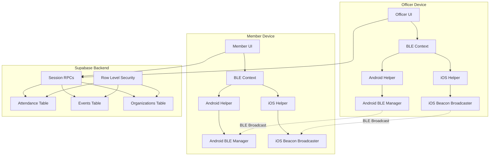

# BLE Attendance System Design

## Overview

The BLE Attendance System leverages the existing FRC Team 2658 BLE modules to implement native Bluetooth Low Energy attendance tracking for NHS/NHSA organizations. The system uses iBeacon protocol for cross-platform compatibility, with officers broadcasting attendance sessions and members automatically checking in when in proximity.

## Architecture

### High-Level Architecture



### Component Architecture

#### Native BLE Layer
- **Android**: BLEBeaconManager (Kotlin) using BluetoothLeAdvertiser and dual scanning modes
- **iOS**: BeaconBroadcaster (Swift) using CBPeripheralManager and CLLocationManager
- **Cross-Platform**: Expo native module integration with JSI/Bridge support

#### React Native Bridge Layer
- **BLEContext**: Global state management with event listeners and error handling
- **BLEHelper**: Platform abstraction with unified API and permission management
- **Permission Helper**: Android API level detection and permission request handling

#### Application Layer
- **Officer Screens**: Session creation, broadcasting controls, attendance monitoring
- **Member Screens**: Auto-detection status, manual check-in fallback, attendance history
- **Shared Components**: BLE status indicators, permission prompts, error boundaries

## Components and Interfaces

### Database Schema Extensions

#### Session Management Functions
```sql
-- Create new attendance session
CREATE OR REPLACE FUNCTION create_session(
    p_org_id UUID,
    p_title TEXT,
    p_starts_at TIMESTAMPTZ,
    p_ttl_seconds INTEGER DEFAULT 3600
) RETURNS TEXT AS $$
DECLARE
    session_token TEXT;
    event_id UUID;
BEGIN
    -- Generate 12-character session token
    session_token := encode(gen_random_bytes(9), 'base64')::TEXT;
    session_token := regexp_replace(session_token, '[^A-Za-z0-9]', '', 'g');
    session_token := substr(session_token, 1, 12);
    
    -- Create event record
    INSERT INTO events (org_id, title, starts_at, ends_at, event_type, created_by)
    VALUES (p_org_id, p_title, p_starts_at, p_starts_at + (p_ttl_seconds || ' seconds')::INTERVAL, 'meeting', auth.uid())
    RETURNING id INTO event_id;
    
    -- Store session token in metadata
    UPDATE events 
    SET description = jsonb_build_object('session_token', session_token, 'ttl_seconds', p_ttl_seconds)::TEXT
    WHERE id = event_id;
    
    RETURN session_token;
END;
$$ LANGUAGE plpgsql SECURITY DEFINER;

-- Resolve session token to valid session
CREATE OR REPLACE FUNCTION resolve_session(p_session_token TEXT)
RETURNS TABLE(org_id UUID, event_id UUID, is_valid BOOLEAN) AS $$
BEGIN
    RETURN QUERY
    SELECT e.org_id, e.id, (e.ends_at > NOW()) as is_valid
    FROM events e
    WHERE e.description::JSONB->>'session_token' = p_session_token
    AND e.starts_at <= NOW()
    AND e.ends_at > NOW();
END;
$$ LANGUAGE plpgsql SECURITY DEFINER;

-- Add attendance record
CREATE OR REPLACE FUNCTION add_attendance(p_session_token TEXT)
RETURNS BOOLEAN AS $$
DECLARE
    session_info RECORD;
    member_org_id UUID;
BEGIN
    -- Resolve session
    SELECT * INTO session_info FROM resolve_session(p_session_token);
    
    IF NOT session_info.is_valid THEN
        RETURN FALSE;
    END IF;
    
    -- Check member belongs to organization
    SELECT org_id INTO member_org_id 
    FROM memberships 
    WHERE user_id = auth.uid() AND org_id = session_info.org_id AND is_active = true;
    
    IF member_org_id IS NULL THEN
        RETURN FALSE;
    END IF;
    
    -- Insert attendance (ON CONFLICT DO NOTHING for duplicate check-ins)
    INSERT INTO attendance (event_id, member_id, method, org_id)
    VALUES (session_info.event_id, auth.uid(), 'ble', session_info.org_id)
    ON CONFLICT (event_id, member_id) DO NOTHING;
    
    RETURN TRUE;
END;
$$ LANGUAGE plpgsql SECURITY DEFINER;
```

### BLE Payload Structure

#### iBeacon Format Adaptation
```typescript
interface AttendanceBeaconPayload {
  uuid: string;        // Organization UUID (existing APP_UUID pattern)
  major: number;       // Organization code (NHS=1, NHSA=2, etc.)
  minor: number;       // Session token hash (12-char → 16-bit)
  txPower: number;     // Signal strength calibration
}

// Encoding functions
function encodeSessionToken(token: string): number {
  // Simple hash to 16-bit for Minor field
  let hash = 0;
  for (let i = 0; i < token.length; i++) {
    hash = ((hash << 5) - hash + token.charCodeAt(i)) & 0xFFFF;
  }
  return hash;
}

function getOrgCode(orgSlug: string): number {
  const orgCodes = { 'nhs': 1, 'nhsa': 2 };
  return orgCodes[orgSlug] || 0;
}
```

### React Native Integration

#### Enhanced BLE Context
```typescript
interface AttendanceBLEContextProps extends BLEContextProps {
  // Session management
  createSession: (title: string, ttlSeconds: number) => Promise<string>;
  startAttendanceSession: (sessionToken: string, orgCode: number) => Promise<void>;
  stopAttendanceSession: () => Promise<void>;
  
  // Member functionality
  enableAutoAttendance: () => Promise<void>;
  disableAutoAttendance: () => Promise<void>;
  
  // Status
  currentSession: AttendanceSession | null;
  autoAttendanceEnabled: boolean;
  detectedSessions: AttendanceSession[];
}

interface AttendanceSession {
  sessionToken: string;
  orgCode: number;
  title: string;
  expiresAt: Date;
  isActive: boolean;
}
```

#### Officer Session Controls
```typescript
// Officer creates and starts session
const startSession = async (title: string, duration: number) => {
  try {
    // Create session in database
    const sessionToken = await createSession(currentOrg.id, title, new Date(), duration);
    
    // Start BLE broadcasting
    const orgCode = getOrgCode(currentOrg.slug);
    const tokenHash = encodeSessionToken(sessionToken);
    
    await startBroadcasting(APP_UUID, orgCode, tokenHash, title);
    
    setCurrentSession({
      sessionToken,
      orgCode,
      title,
      expiresAt: new Date(Date.now() + duration * 1000),
      isActive: true
    });
  } catch (error) {
    handleSessionError(error);
  }
};
```

#### Member Auto-Detection
```typescript
// Member auto-attendance when beacon detected
const handleBeaconDetected = async (beacon: Beacon) => {
  if (!autoAttendanceEnabled) return;
  
  try {
    // Decode session info from beacon
    const orgCode = beacon.major;
    const tokenHash = beacon.minor;
    
    // Verify organization match
    if (orgCode !== getOrgCode(currentOrg.slug)) return;
    
    // Find matching session token (reverse lookup)
    const sessionToken = await resolveTokenHash(tokenHash);
    if (!sessionToken) return;
    
    // Submit attendance
    const success = await addAttendance(sessionToken);
    if (success) {
      showAttendanceConfirmation(sessionToken);
    }
  } catch (error) {
    handleAttendanceError(error);
  }
};
```

## Data Models

### Extended Event Model
```typescript
interface AttendanceEvent extends Event {
  sessionToken?: string;
  ttlSeconds?: number;
  attendanceMethod: 'manual' | 'ble' | 'qr';
  maxCapacity?: number;
  requiresApproval: boolean;
}
```

### Attendance Record Model
```typescript
interface AttendanceRecord {
  id: string;
  eventId: string;
  memberId: string;
  checkinTime: Date;
  method: 'manual' | 'ble' | 'qr';
  recordedBy?: string;
  status: 'present' | 'late' | 'excused';
  note?: string;
  orgId: string;
  bleData?: {
    rssi: number;
    distance: number;
    sessionToken: string;
  };
}
```

### BLE Session State
```typescript
interface BLESessionState {
  // Officer state
  isOfficer: boolean;
  activeSessions: AttendanceSession[];
  broadcastingStatus: 'idle' | 'starting' | 'active' | 'stopping' | 'error';
  
  // Member state
  scanningStatus: 'idle' | 'scanning' | 'detected' | 'submitted' | 'error';
  autoAttendanceEnabled: boolean;
  detectedSessions: AttendanceSession[];
  attendanceHistory: AttendanceRecord[];
  
  // Shared state
  bluetoothState: string;
  permissions: PermissionStatus;
  lastError?: BLEError;
}
```

## Error Handling

### BLE Error Categories
```typescript
enum BLEErrorType {
  BLUETOOTH_DISABLED = 'bluetooth_disabled',
  PERMISSIONS_DENIED = 'permissions_denied',
  HARDWARE_UNSUPPORTED = 'hardware_unsupported',
  SESSION_EXPIRED = 'session_expired',
  ORGANIZATION_MISMATCH = 'organization_mismatch',
  NETWORK_ERROR = 'network_error',
  INVALID_TOKEN = 'invalid_token'
}

interface BLEError {
  type: BLEErrorType;
  message: string;
  details?: any;
  recoverable: boolean;
  suggestedAction?: string;
}
```

### Error Recovery Strategies
- **Bluetooth Disabled**: Show system settings deep link
- **Permissions Denied**: Progressive permission request with rationale
- **Hardware Unsupported**: Graceful fallback to manual attendance
- **Session Expired**: Auto-refresh session list, notify officer
- **Organization Mismatch**: Silent filtering, no user notification
- **Network Error**: Retry with exponential backoff, offline queue

## Testing Strategy

### Unit Testing
- **Native Module Mocking**: Mock BLE operations for Jest tests
- **Permission Testing**: Test all Android API level combinations
- **Token Encoding**: Verify hash collision rates and reversibility
- **Session Validation**: Test expiration, organization isolation, duplicate handling

### Integration Testing
- **Cross-Platform**: Test Android ↔ iOS beacon communication
- **Database Integration**: Verify RLS policies and foreign key constraints
- **Real-Time Events**: Test event emission and subscription cleanup
- **Error Scenarios**: Bluetooth state changes, permission revocation

### End-to-End Testing
- **Officer Workflow**: Create session → Start broadcasting → Monitor attendance
- **Member Workflow**: Enable auto-attendance → Detect beacon → Confirm submission
- **Multi-Organization**: Verify isolation between NHS and NHSA sessions
- **Performance**: Battery usage, memory leaks, concurrent sessions

### EAS Development Client Testing
```bash
# Build development clients
eas build --profile development --platform android
eas build --profile development --platform ios

# Install and test
eas device:create
eas build:run --platform android
eas build:run --platform ios

# Test BLE functionality
# - Officer creates session on Device A
# - Member detects session on Device B
# - Verify attendance recorded in Supabase
```

### Testing Checklist
- [ ] Android 12+ permission flow
- [ ] iOS 16+ CoreLocation authorization
- [ ] Background/foreground state transitions
- [ ] Multiple concurrent sessions
- [ ] Session expiration handling
- [ ] Organization isolation
- [ ] Network connectivity issues
- [ ] Battery optimization impact
- [ ] Memory leak detection
- [ ] Cross-platform beacon detection

## Security Considerations

### Session Token Security
- **Generation**: Cryptographically secure random tokens (9 bytes → base64 → 12 chars)
- **Transmission**: Only hash transmitted via BLE (16-bit Minor field)
- **Validation**: Server-side session resolution and expiration checking
- **Isolation**: RLS policies prevent cross-organization access

### BLE Security
- **Payload Minimization**: Only org code and token hash in beacon data
- **No Personal Data**: No user IDs or names in BLE advertisements
- **Range Limitation**: Physical proximity required (≈30m range)
- **Replay Protection**: Session expiration prevents token reuse

### Database Security
- **RLS Enforcement**: All attendance operations respect organization boundaries
- **Input Validation**: Session tokens validated against known format
- **Audit Trail**: All attendance submissions logged with method and timestamp
- **Permission Checks**: Member organization membership verified before attendance

This design provides a comprehensive, secure, and scalable BLE attendance system that leverages the existing FRC 2658 codebase while integrating seamlessly with the current NHS/NHSA application architecture.