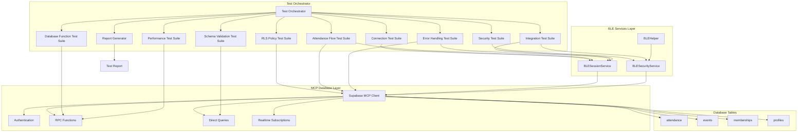

# BLE Live Integration Testing & Database Verification Design

## Overview

The BLE Live Integration Testing system is a comprehensive testing framework that validates the entire BLE attendance system through real-time database operations using Supabase MCP (Model Context Protocol). Unlike static analysis, this system executes actual database queries, RPC function calls, and BLE service operations to verify production readiness. The design emphasizes real-world testing scenarios, comprehensive RLS policy validation, and detailed reporting to ensure zero conflicts in member attendance workflows.

## Architecture

### System Architecture



### Testing Methodology

#### Phase 1: Environment Setup & Authentication
- **MCP Client Initialization**: Establish connection to Supabase using MCP
- **User Authentication**: Authenticate test user and retrieve session
- **Organization Context**: Identify user's organization and role
- **Baseline Validation**: Verify database connectivity and basic query execution

#### Phase 2: RLS Policy Comprehensive Audit
- **Table-by-Table Analysis**: Test each table's SELECT, INSERT, UPDATE, DELETE policies
- **Member Permission Testing**: Verify members can perform self-service operations
- **Officer Permission Testing**: Verify officers have elevated permissions
- **Cross-Organization Testing**: Attempt unauthorized access to verify isolation
- **Policy Conflict Detection**: Identify conflicting or missing policies

#### Phase 3: Database Function Validation
- **Function Existence Check**: Verify all required RPC functions exist
- **Permission Validation**: Test function execution with different user roles
- **Input Validation Testing**: Test functions with valid and invalid inputs
- **Error Response Analysis**: Verify appropriate error messages and codes
- **Performance Measurement**: Record function execution times

#### Phase 4: BLE Service Integration Testing
- **Session Creation Testing**: Verify BLESessionService.createSession works
- **Token Generation Testing**: Verify BLESecurityService.generateSecureToken works
- **Session Resolution Testing**: Verify session token resolution returns correct data
- **Beacon Payload Testing**: Verify beacon payload generation is correct
- **Status Checking**: Verify session status queries work correctly

#### Phase 5: End-to-End Attendance Flow
- **Officer Workflow**: Create session → Generate token → Broadcast → Monitor
- **Member Workflow**: Detect beacon → Resolve session → Submit attendance → Verify
- **Duplicate Prevention**: Test 30-second window enforcement
- **Real-time Updates**: Verify attendance records appear immediately
- **Data Integrity**: Verify all fields are correctly populated

#### Phase 6: Error Handling & Edge Cases
- **Invalid Token Testing**: Test with malformed, expired, and non-existent tokens
- **Permission Denial Testing**: Test unauthorized operations
- **Network Failure Simulation**: Test behavior during connection issues
- **Concurrent Operation Testing**: Test race conditions and deadlocks
- **Boundary Condition Testing**: Test with edge case values

#### Phase 7: Performance & Scalability
- **Concurrent Session Creation**: Test multiple officers creating sessions simultaneously
- **Concurrent Attendance Submission**: Test multiple members checking in simultaneously
- **Query Performance Analysis**: Measure response times for all operations
- **Resource Utilization**: Monitor database connections and memory usage
- **Bottleneck Identification**: Identify slow queries and optimization opportunities

## Components and Interfaces

### Test Orchestrator

```typescript
interface TestOrchestrator {
  initialize(): Promise<void>;
  runAllTests(): Promise<TestSummary>;
  runTestSuite(suiteName: string): Promise<TestSuiteResult>;
  generateReport(): TestReport;
  cleanup(): Promise<void>;
}

interface TestSummary {
  totalTests: number;
  passed: number;
  failed: number;
  warnings: number;
  info: number;
  duration: number;
  suiteResults: TestSuiteResult[];
  overallStatus: 'PASS' | 'FAIL' | 'WARNING';
  criticalIssues: CriticalIssue[];
}

interface TestSuiteResult {
  suiteName: string;
  tests: TestResult[];
  passed: number;
  failed: number;
  duration: number;
  status: 'PASS' | 'FAIL' | 'WARNING';
}

interface TestResult {
  category: string;
  test: string;
  status: 'PASS' | 'FAIL' | 'WARNING' | 'INFO';
  message: string;
  details?: any;
  duration?: number;
  error?: Error;
}
```

### RLS Policy Test Suite

```typescript
interface RLSPolicyTestSuite {
  testAttendanceTablePolicies(): Promise<TestResult[]>;
  testEventsTablePolicies(): Promise<TestResult[]>;
  testMembershipsTablePolicies(): Promise<TestResult[]>;
  testProfilesTablePolicies(): Promise<TestResult[]>;
  testCrossOrganizationIsolation(): Promise<TestResult[]>;
  auditAllPolicies(): Promise<RLSAuditReport>;
}

interface RLSAuditReport {
  tablesAudited: string[];
  policiesFound: PolicyInfo[];
  policiesMissing: string[];
  permissionIssues: PermissionIssue[];
  isolationViolations: IsolationViolation[];
  overallRating: 'SECURE' | 'MODERATE' | 'VULNERABLE';
}

interface PolicyInfo {
  tableName: string;
  policyName: string;
  operation: 'SELECT' | 'INSERT' | 'UPDATE' | 'DELETE';
  roles: string[];
  definition: string;
  tested: boolean;
  testResult: 'PASS' | 'FAIL' | 'NOT_TESTED';
}

interface PermissionIssue {
  tableName: string;
  operation: string;
  expectedBehavior: string;
  actualBehavior: string;
  severity: 'CRITICAL' | 'HIGH' | 'MEDIUM' | 'LOW';
  recommendation: string;
}
```

### Database Function Test Suite

```typescript
interface DatabaseFunctionTestSuite {
  testAddAttendanceSecure(): Promise<TestResult[]>;
  testCreateSessionSecure(): Promise<TestResult[]>;
  testResolveSession(): Promise<TestResult[]>;
  testGetActiveSessions(): Promise<TestResult[]>;
  testFunctionPermissions(): Promise<FunctionPermissionReport>;
}

interface FunctionPermissionReport {
  functionsFound: string[];
  functionsMissing: string[];
  accessibleFunctions: FunctionAccessInfo[];
  deniedFunctions: FunctionAccessInfo[];
  overallStatus: 'ACCESSIBLE' | 'PARTIAL' | 'BLOCKED';
}

interface FunctionAccessInfo {
  functionName: string;
  accessible: boolean;
  testedWithRole: string;
  errorMessage?: string;
  executionTime?: number;
  testInputs: any;
  testOutputs: any;
}
```

### Attendance Flow Test Suite

```typescript
interface AttendanceFlowTestSuite {
  testOfficerWorkflow(): Promise<TestResult[]>;
  testMemberWorkflow(): Promise<TestResult[]>;
  testDuplicatePrevention(): Promise<TestResult[]>;
  testTimestampAccuracy(): Promise<TestResult[]>;
  testDataIntegrity(): Promise<TestResult[]>;
  runEndToEndFlow(): Promise<EndToEndFlowResult>;
}

interface EndToEndFlowResult {
  steps: FlowStep[];
  overallSuccess: boolean;
  duration: number;
  attendanceRecordCreated: boolean;
  attendanceRecordId?: string;
  errors: FlowError[];
}

interface FlowStep {
  stepName: string;
  operation: string;
  input: any;
  output: any;
  success: boolean;
  duration: number;
  timestamp: Date;
}

interface FlowError {
  step: string;
  errorType: string;
  message: string;
  stack?: string;
  recoverable: boolean;
}
```

### Schema Validation Test Suite

```typescript
interface SchemaValidationTestSuite {
  validateAttendanceTable(): Promise<TestResult[]>;
  validateEventsTable(): Promise<TestResult[]>;
  validateMembershipsTable(): Promise<TestResult[]>;
  validateProfilesTable(): Promise<TestResult[]>;
  validateForeignKeys(): Promise<TestResult[]>;
  validateIndexes(): Promise<TestResult[]>;
  generateSchemaReport(): Promise<SchemaReport>;
}

interface SchemaReport {
  tablesValidated: string[];
  requiredColumnsPresent: ColumnValidation[];
  requiredColumnsMissing: ColumnValidation[];
  foreignKeysValid: ForeignKeyValidation[];
  indexesPresent: IndexValidation[];
  overallStatus: 'VALID' | 'ISSUES_FOUND' | 'CRITICAL_MISSING';
}

interface ColumnValidation {
  tableName: string;
  columnName: string;
  dataType: string;
  nullable: boolean;
  present: boolean;
}

interface ForeignKeyValidation {
  constraintName: string;
  fromTable: string;
  fromColumn: string;
  toTable: string;
  toColumn: string;
  valid: boolean;
}
```

### Performance Test Suite

```typescript
interface PerformanceTestSuite {
  testConcurrentSessionCreation(count: number): Promise<PerformanceResult>;
  testConcurrentAttendanceSubmission(count: number): Promise<PerformanceResult>;
  measureQueryPerformance(): Promise<QueryPerformanceReport>;
  identifyBottlenecks(): Promise<BottleneckReport>;
}

interface PerformanceResult {
  operationName: string;
  concurrentOperations: number;
  successCount: number;
  failureCount: number;
  averageTime: number;
  minTime: number;
  maxTime: number;
  p95Time: number;
  p99Time: number;
  throughput: number;
  errors: PerformanceError[];
}

interface QueryPerformanceReport {
  queries: QueryPerformance[];
  slowQueries: QueryPerformance[];
  averageQueryTime: number;
  recommendations: string[];
}

interface QueryPerformance {
  queryName: string;
  query: string;
  executionTime: number;
  rowsAffected: number;
  slow: boolean;
}

interface BottleneckReport {
  bottlenecks: Bottleneck[];
  resourceConstraints: ResourceConstraint[];
  optimizationRecommendations: string[];
}

interface Bottleneck {
  component: string;
  operation: string;
  averageTime: number;
  impact: 'HIGH' | 'MEDIUM' | 'LOW';
  recommendation: string;
}
```

### Security Test Suite

```typescript
interface SecurityTestSuite {
  testTokenGeneration(): Promise<TestResult[]>;
  testTokenValidation(): Promise<TestResult[]>;
  testCollisionResistance(sampleSize: number): Promise<CollisionTestResult>;
  testTokenSecurity(): Promise<SecurityReport>;
}

interface CollisionTestResult {
  tokensGenerated: number;
  uniqueTokens: number;
  duplicates: number;
  collisionRate: number;
  entropyEstimate: number;
  passed: boolean;
}

interface SecurityReport {
  tokenSecurityRating: 'SECURE' | 'MODERATE' | 'WEAK';
  entropyBits: number;
  collisionProbability: number;
  vulnerabilities: SecurityVulnerability[];
  recommendations: string[];
}

interface SecurityVulnerability {
  type: string;
  severity: 'CRITICAL' | 'HIGH' | 'MEDIUM' | 'LOW';
  description: string;
  impact: string;
  remediation: string;
}
```

### Integration Test Suite

```typescript
interface IntegrationTestSuite {
  testBLESessionServiceIntegration(): Promise<TestResult[]>;
  testBLESecurityServiceIntegration(): Promise<TestResult[]>;
  testServiceInteroperability(): Promise<TestResult[]>;
  testDatabaseServiceIntegration(): Promise<TestResult[]>;
  generateIntegrationReport(): Promise<IntegrationReport>;
}

interface IntegrationReport {
  servicesT tested: string[];
  integrationPoints: IntegrationPoint[];
  failures: IntegrationFailure[];
  overallHealth: 'HEALTHY' | 'DEGRADED' | 'FAILING';
}

interface IntegrationPoint {
  fromService: string;
  toService: string;
  operation: string;
  tested: boolean;
  success: boolean;
  latency: number;
}

interface IntegrationFailure {
  services: string[];
  operation: string;
  errorMessage: string;
  impact: 'CRITICAL' | 'HIGH' | 'MEDIUM' | 'LOW';
  recommendation: string;
}
```

## Data Models

### Test Configuration

```typescript
interface TestConfiguration {
  supabaseUrl: string;
  supabaseAnonKey: string;
  testUserId?: string;
  testOrgId?: string;
  performanceSampleSize: number;
  concurrencyTestSize: number;
  tokenCollisionSampleSize: number;
  timeoutMs: number;
  retryAttempts: number;
}

interface TestContext {
  user: User;
  organization: Organization;
  role: 'member' | 'officer' | 'admin';
  memberships: Membership[];
  startTime: Date;
  endTime?: Date;
}

interface User {
  id: string;
  email: string;
  authenticated: boolean;
}

interface Organization {
  id: string;
  name: string;
  code: string;
}

interface Membership {
  id: string;
  userId: string;
  orgId: string;
  role: string;
  isActive: boolean;
}
```

### Test Results Models

```typescript
interface CriticalIssue {
  id: string;
  category: string;
  severity: 'CRITICAL' | 'HIGH' | 'MEDIUM' | 'LOW';
  title: string;
  description: string;
  impact: string;
  evidence: Evidence[];
  recommendation: string;
  deploymentBlocker: boolean;
}

interface Evidence {
  type: 'ERROR' | 'QUERY_RESULT' | 'PERFORMANCE_METRIC' | 'SECURITY_FINDING';
  description: string;
  data: any;
  timestamp: Date;
}

interface TestReport {
  executionTimestamp: Date;
  duration: number;
  testContext: TestContext;
  summary: TestSummary;
  suiteResults: TestSuiteResult[];
  criticalIssues: CriticalIssue[];
  recommendations: Recommendation[];
  productionReadiness: ProductionReadinessAssessment;
}

interface Recommendation {
  priority: 'IMMEDIATE' | 'HIGH' | 'MEDIUM' | 'LOW';
  category: string;
  title: string;
  description: string;
  actionSteps: string[];
  estimatedEffort: string;
}

interface ProductionReadinessAssessment {
  overallRating: 'READY' | 'CONDITIONAL' | 'NOT_READY';
  confidenceLevel: 'HIGH' | 'MEDIUM' | 'LOW';
  criticalBlockers: string[];
  goNoGoRecommendation: 'GO' | 'NO_GO' | 'CONDITIONAL_GO';
  conditions: string[];
  riskLevel: 'LOW' | 'MEDIUM' | 'HIGH' | 'CRITICAL';
}
```

## Error Handling

### Error Categories

```typescript
enum TestErrorType {
  // Database Errors
  CONNECTION_FAILED = 'connection_failed',
  AUTHENTICATION_FAILED = 'authentication_failed',
  QUERY_FAILED = 'query_failed',
  RPC_FUNCTION_NOT_FOUND = 'rpc_function_not_found',
  PERMISSION_DENIED = 'permission_denied',
  RLS_VIOLATION = 'rls_violation',
  
  // BLE Service Errors
  SESSION_CREATION_FAILED = 'session_creation_failed',
  TOKEN_GENERATION_FAILED = 'token_generation_failed',
  SESSION_RESOLUTION_FAILED = 'session_resolution_failed',
  ATTENDANCE_SUBMISSION_FAILED = 'attendance_submission_failed',
  
  // Validation Errors
  SCHEMA_VALIDATION_FAILED = 'schema_validation_failed',
  DATA_INTEGRITY_FAILED = 'data_integrity_failed',
  SECURITY_VALIDATION_FAILED = 'security_validation_failed',
  
  // Performance Errors
  TIMEOUT = 'timeout',
  PERFORMANCE_DEGRADATION = 'performance_degradation',
  CONCURRENCY_FAILURE = 'concurrency_failure',
  
  // Configuration Errors
  MISSING_CONFIGURATION = 'missing_configuration',
  INVALID_TEST_CONTEXT = 'invalid_test_context'
}

interface TestError {
  type: TestErrorType;
  message: string;
  details: any;
  stack?: string;
  recoverable: boolean;
  retryable: boolean;
}
```

### Error Recovery Strategies

- **Connection Failures**: Retry with exponential backoff (3 attempts)
- **Authentication Failures**: Report immediately, do not retry
- **Permission Denied**: Document and continue with other tests
- **RLS Violations**: Expected in some tests, validate error message
- **Timeout Errors**: Retry once with increased timeout
- **Concurrency Failures**: Reduce concurrency level and retry
- **Schema Validation Failures**: Report and continue with available schema

## Testing Strategy

### Test Execution Order

1. **Environment Setup** (CRITICAL - must pass to continue)
   - Initialize MCP client
   - Authenticate user
   - Verify database connectivity
   - Load test context

2. **Schema Validation** (HIGH - validates database structure)
   - Validate table structures
   - Check required columns
   - Verify foreign keys
   - Check indexes

3. **RLS Policy Audit** (CRITICAL - validates security)
   - Test attendance table policies
   - Test events table policies
   - Test memberships table policies
   - Test cross-organization isolation

4. **Database Function Validation** (CRITICAL - validates core functionality)
   - Test add_attendance_secure
   - Test create_session_secure
   - Test resolve_session
   - Test function permissions

5. **BLE Service Integration** (HIGH - validates service layer)
   - Test BLESessionService
   - Test BLESecurityService
   - Test service interoperability

6. **Attendance Flow Testing** (CRITICAL - validates end-to-end workflow)
   - Test officer workflow
   - Test member workflow
   - Test duplicate prevention
   - Verify data integrity

7. **Error Handling** (MEDIUM - validates robustness)
   - Test invalid inputs
   - Test permission denials
   - Test edge cases

8. **Performance Testing** (MEDIUM - validates scalability)
   - Test concurrent operations
   - Measure query performance
   - Identify bottlenecks

9. **Security Testing** (HIGH - validates token security)
   - Test token generation
   - Test collision resistance
   - Validate security metrics

### Success Criteria

#### Critical Tests (Must Pass)
- User authentication succeeds
- Database connectivity established
- RLS policies allow member self-service attendance
- add_attendance_secure function accessible and functional
- End-to-end attendance flow completes successfully
- No cross-organization data leakage

#### High Priority Tests (Should Pass)
- All required database functions accessible
- Schema validation passes
- BLE services integrate correctly with database
- Performance meets acceptable thresholds (< 2s for attendance submission)
- Token security validation passes

#### Medium Priority Tests (Nice to Pass)
- Concurrent operations handle gracefully
- Error messages are clear and actionable
- Performance optimization opportunities identified

### Failure Handling

- **Critical Test Failure**: Stop execution, report immediately
- **High Priority Failure**: Continue testing, flag as deployment blocker
- **Medium Priority Failure**: Continue testing, flag as warning
- **Low Priority Failure**: Continue testing, include in recommendations

## Security Considerations

### Test Data Security
- Use test accounts only, never production user data
- Generate temporary test sessions that auto-expire
- Clean up test data after execution
- Never log sensitive information (passwords, tokens in plain text)

### RLS Policy Testing Approach
- Test with actual authenticated users, not service role
- Verify policies block unauthorized access, not just allow authorized access
- Test both positive (should succeed) and negative (should fail) cases
- Document any policy bypasses or weaknesses

### Token Security Validation
- Verify minimum 62 bits of entropy
- Test collision resistance with statistical analysis
- Validate token format and sanitization
- Ensure tokens are not predictable or sequential

### Database Security
- Verify all RPC functions use security definer appropriately
- Check for SQL injection vulnerabilities in function parameters
- Validate input sanitization and validation
- Ensure error messages don't leak sensitive information

## MCP Integration

### Supabase MCP Client Usage

```typescript
// Initialize MCP client
const supabase = createClient(
  process.env.SUPABASE_URL!,
  process.env.SUPABASE_ANON_KEY!
);

// Authenticate
const { data: { user }, error } = await supabase.auth.getUser();

// Execute RPC functions
const { data, error } = await supabase.rpc('add_attendance_secure', {
  p_session_token: token
});

// Query tables
const { data, error } = await supabase
  .from('attendance')
  .select('*')
  .eq('member_id', userId);

// Test RLS policies
const { data, error } = await supabase
  .from('attendance')
  .insert({ event_id, member_id, org_id, method: 'ble' });
```

### MCP Error Handling

- Distinguish between network errors, permission errors, and validation errors
- Capture full error context including error code, message, and details
- Retry transient errors (network, timeout) but not permanent errors (permission denied)
- Log all MCP operations for debugging and audit trail

This comprehensive design provides a robust framework for live integration testing of the BLE attendance system, ensuring production readiness through real-world database operations and comprehensive validation.
