# BLE System Validation & Testing Protocol Design

## Overview

The BLE System Validation & Testing Protocol is a comprehensive, multi-layered analysis framework designed to rigorously validate the entire BLE attendance system without requiring physical devices. This protocol employs static code analysis, database simulation, security auditing, and performance modeling to determine production readiness with high confidence. The design follows a "Trust Nothing, Verify Everything" philosophy, systematically examining each component from native modules to database operations.

## Architecture

### Validation Framework Architecture

```mermaid
graph TB
    subgraph "Validation Controller"
        VC[Validation Controller] --> SAE[Static Analysis Engine]
        VC --> DSE[Database Simulation Engine]
        VC --> SEC[Security Audit Engine]
        VC --> PAE[Performance Analysis Engine]
        VC --> CAE[Configuration Audit Engine]
        VC --> REP[Report Generator]
    end
    
    subgraph "Analysis Targets"
        subgraph "Native Layer"
            IOS[iOS Swift Modules]
            AND[Android Kotlin Modules]
        end
        
        subgraph "Bridge Layer"
            BLE[BLEContext]
            HLP[BLEHelper]
            PRM[Permission Helper]
        end
        
        subgraph "Database Layer"
            RPC[Session RPCs]
            RLS[RLS Policies]
            SCH[Schema Validation]
        end
        
        subgraph "Configuration Layer"
            APP[app.json]
            EAS[eas.json]
            PKG[package.json]
        end
    end
    
    SAE --> IOS
    SAE --> AND
    SAE --> BLE
    SAE --> HLP
    
    DSE --> RPC
    DSE --> RLS
    DSE --> SCH
    
    SEC --> RPC
    SEC --> BLE
    SEC --> RLS
    
    PAE --> RPC
    PAE --> BLE
    
    CAE --> APP
    CAE --> EAS
    CAE --> PKG
    
    REP --> EXEC[Executive Summary]
    REP --> TECH[Technical Analysis]
    REP --> ISS[Issue Tracker]
    REP --> CHK[Deployment Checklist]
```



### Validation Methodology

#### Phase 1: Static Code Analysis
- **Native Module Inspection**: Deep analysis of iOS Swift and Android Kotlin implementations
- **Bridge Layer Review**: JavaScript/TypeScript integration and state management validation
- **Code Quality Assessment**: Memory leaks, threading issues, error handling evaluation
- **Interface Verification**: Function signatures, module registration, and Expo integration

#### Phase 2: Database Simulation & Security
- **Function Validation**: SQL syntax, logic flow, and RLS compliance testing
- **Security Audit**: Token generation, injection prevention, and access control verification
- **Performance Testing**: Concurrent operation simulation and query optimization analysis
- **Data Integrity**: Foreign key constraints, transaction handling, and error recovery

#### Phase 3: End-to-End Flow Simulation
- **Officer Workflow**: Session creation, broadcasting initiation, and monitoring simulation
- **Member Workflow**: Beacon detection, token resolution, and attendance submission tracing
- **Error Scenarios**: Invalid tokens, expired sessions, and cross-organization access testing
- **Integration Validation**: Complete call stack verification and data flow analysis

#### Phase 4: Performance & Scalability Analysis
- **Concurrent User Simulation**: 150-user load testing through database operations
- **Resource Usage Estimation**: Battery, memory, and CPU consumption modeling
- **Bottleneck Identification**: Query performance, subscription limits, and native operation constraints
- **Scalability Assessment**: Maximum capacity determination and optimization recommendations

#### Phase 5: Configuration & Deployment Readiness
- **Permission Audit**: iOS and Android permission declarations and usage descriptions
- **Build Configuration**: EAS profiles, native module integration, and deployment settings
- **Environment Validation**: APP_UUID configuration, background modes, and API level requirements
- **Documentation Review**: User guides, troubleshooting procedures, and deployment checklists

## Components and Interfaces

### Static Analysis Engine

#### Native Module Analyzer
```typescript
interface NativeModuleAnalyzer {
  analyzeIOSModule(modulePath: string): IOSAnalysisResult;
  analyzeAndroidModule(modulePath: string): AndroidAnalysisResult;
  validateExpoIntegration(moduleConfig: ExpoModuleConfig): IntegrationResult;
  checkMemoryManagement(codeContent: string): MemoryAnalysisResult;
  validateThreadSafety(codeContent: string): ThreadSafetyResult;
}

interface IOSAnalysisResult {
  coreBluetoothIntegration: ValidationResult;
  moduleRegistration: ValidationResult;
  iBeaconConfiguration: ValidationResult;
  permissionHandling: ValidationResult;
  backgroundModeSupport: ValidationResult;
  memoryLeakRisks: MemoryLeakAssessment[];
  threadingIssues: ThreadingIssue[];
  overallRating: 'PASS' | 'FAIL' | 'CONDITIONAL';
}

interface AndroidAnalysisResult {
  bluetoothLeIntegration: ValidationResult;
  altBeaconLibraryUsage: ValidationResult;
  permissionHandling: ValidationResult;
  dualScanningMode: ValidationResult;
  beaconTransmitterSetup: ValidationResult;
  memoryLeakRisks: MemoryLeakAssessment[];
  threadingIssues: ThreadingIssue[];
  overallRating: 'PASS' | 'FAIL' | 'CONDITIONAL';
}
```

#### Bridge Layer Analyzer
```typescript
interface BridgeLayerAnalyzer {
  analyzeBLEContext(contextPath: string): BLEContextAnalysis;
  analyzeBLEHelper(helperPath: string): BLEHelperAnalysis;
  validatePermissionFlow(permissionPath: string): PermissionFlowAnalysis;
  checkStateManagement(contextContent: string): StateManagementResult;
  validateEventHandling(contextContent: string): EventHandlingResult;
}

interface BLEContextAnalysis {
  nativeModuleImports: ValidationResult;
  permissionRequestFlow: ValidationResult;
  broadcastingStateManagement: ValidationResult;
  scanningStateManagement: ValidationResult;
  eventListenersCleanup: ValidationResult;
  errorHandling: ValidationResult;
  raceConditionRisks: RaceConditionAssessment[];
  memoryLeakRisks: MemoryLeakAssessment[];
  overallQuality: 'EXCELLENT' | 'GOOD' | 'NEEDS_IMPROVEMENT' | 'POOR';
}

interface BLEHelperAnalysis {
  sessionTokenGeneration: SecurityAnalysis;
  tokenHashingAlgorithm: SecurityAnalysis;
  organizationCodeMapping: ValidationResult;
  uuidValidation: ValidationResult;
  distanceCalculation: ValidationResult;
  collisionResistance: CollisionAnalysis;
  overallSecurity: 'SECURE' | 'MODERATE' | 'VULNERABLE';
}
```

### Database Simulation Engine

#### Function Validator
```typescript
interface DatabaseFunctionValidator {
  validateCreateSession(functionSQL: string): FunctionValidationResult;
  validateResolveSession(functionSQL: string): FunctionValidationResult;
  validateAddAttendance(functionSQL: string): FunctionValidationResult;
  testConcurrentOperations(userCount: number): ConcurrencyTestResult;
  validateRLSPolicies(schemaPath: string): RLSValidationResult;
}

interface FunctionValidationResult {
  syntaxValidation: ValidationResult;
  securityDefinerUsage: ValidationResult;
  rlsCompliance: ValidationResult;
  inputValidation: ValidationResult;
  errorHandling: ValidationResult;
  performanceOptimization: ValidationResult;
  securityVulnerabilities: SecurityVulnerability[];
  overallRating: 'SECURE' | 'MODERATE' | 'VULNERABLE';
}

interface ConcurrencyTestResult {
  maxConcurrentUsers: number;
  averageResponseTime: number;
  errorRate: number;
  deadlockRisks: DeadlockAssessment[];
  bottlenecks: PerformanceBottleneck[];
  scalabilityRating: 'EXCELLENT' | 'GOOD' | 'LIMITED' | 'POOR';
}
```

#### Security Audit Engine
```typescript
interface SecurityAuditEngine {
  auditTokenSecurity(tokenGenerator: string): TokenSecurityAudit;
  auditDatabaseSecurity(functions: string[]): DatabaseSecurityAudit;
  auditBLEPayloadSecurity(payloadStructure: BLEPayload): PayloadSecurityAudit;
  auditOrganizationIsolation(rlsPolicies: string[]): IsolationAudit;
  generateSecurityReport(): SecurityAuditReport;
}

interface TokenSecurityAudit {
  entropyAnalysis: EntropyAnalysis;
  collisionResistance: CollisionAnalysis;
  transmissionSecurity: TransmissionSecurityAnalysis;
  replayProtection: ReplayProtectionAnalysis;
  overallSecurityRating: 'HIGH' | 'MEDIUM' | 'LOW';
}

interface DatabaseSecurityAudit {
  sqlInjectionRisks: SQLInjectionAssessment[];
  rlsBypassRisks: RLSBypassAssessment[];
  informationDisclosureRisks: InformationDisclosureRisk[];
  accessControlValidation: AccessControlResult;
  overallSecurityRating: 'SECURE' | 'MODERATE' | 'VULNERABLE';
}
```

### Performance Analysis Engine

#### Scalability Analyzer
```typescript
interface ScalabilityAnalyzer {
  simulateConcurrentSessions(userCount: number): SessionSimulationResult;
  analyzeQueryPerformance(queries: string[]): QueryPerformanceResult;
  estimateResourceUsage(operationProfile: OperationProfile): ResourceUsageEstimate;
  identifyBottlenecks(systemProfile: SystemProfile): BottleneckAnalysis;
}

interface SessionSimulationResult {
  sessionCreationTime: PerformanceMetric;
  attendanceSubmissionTime: PerformanceMetric;
  concurrentSessionLimit: number;
  databaseConnectionUsage: ResourceMetric;
  realTimeSubscriptionLoad: ResourceMetric;
  overallPerformance: 'EXCELLENT' | 'GOOD' | 'ACCEPTABLE' | 'POOR';
}

interface ResourceUsageEstimate {
  batteryDrainEstimate: BatteryUsageProfile;
  memoryConsumption: MemoryUsageProfile;
  cpuUtilization: CPUUsageProfile;
  networkBandwidth: NetworkUsageProfile;
  sustainabilityRating: 'SUSTAINABLE' | 'MODERATE' | 'CONCERNING';
}
```

### Configuration Audit Engine

#### Configuration Validator
```typescript
interface ConfigurationValidator {
  auditAppConfig(appConfigPath: string): AppConfigAudit;
  auditEASConfig(easConfigPath: string): EASConfigAudit;
  auditPackageConfig(packagePath: string): PackageConfigAudit;
  validateIOSPermissions(infoPlist: string): IOSPermissionAudit;
  validateAndroidPermissions(manifest: string): AndroidPermissionAudit;
}

interface AppConfigAudit {
  appUUIDPresence: ValidationResult;
  iosPermissions: PermissionValidationResult[];
  iosBackgroundModes: BackgroundModeValidation;
  androidPermissions: PermissionValidationResult[];
  expoPluginConfiguration: PluginConfigurationResult;
  overallReadiness: 'READY' | 'NEEDS_CONFIGURATION' | 'MISSING_CRITICAL';
}

interface DeploymentReadinessAssessment {
  configurationCompleteness: number; // 0-100%
  criticalMissingItems: string[];
  recommendedOptimizations: string[];
  deploymentRisk: 'LOW' | 'MEDIUM' | 'HIGH';
}
```

## Data Models

### Validation Result Models

#### Comprehensive Analysis Result
```typescript
interface BLESystemValidationResult {
  executionTimestamp: Date;
  validationVersion: string;
  
  // Component Analysis Results
  nativeModuleAnalysis: {
    ios: IOSAnalysisResult;
    android: AndroidAnalysisResult;
  };
  
  bridgeLayerAnalysis: {
    bleContext: BLEContextAnalysis;
    bleHelper: BLEHelperAnalysis;
    permissionFlow: PermissionFlowAnalysis;
  };
  
  databaseAnalysis: {
    functionValidation: FunctionValidationResult[];
    securityAudit: DatabaseSecurityAudit;
    performanceTest: ConcurrencyTestResult;
  };
  
  endToEndSimulation: {
    officerFlow: FlowSimulationResult;
    memberFlow: FlowSimulationResult;
    errorScenarios: ErrorScenarioResult[];
  };
  
  performanceAnalysis: {
    scalabilityAssessment: ScalabilityAnalyzer;
    resourceUsage: ResourceUsageEstimate;
    bottleneckAnalysis: BottleneckAnalysis;
  };
  
  configurationAudit: {
    appConfig: AppConfigAudit;
    easConfig: EASConfigAudit;
    deploymentReadiness: DeploymentReadinessAssessment;
  };
  
  // Overall Assessment
  overallRating: 'PRODUCTION_READY' | 'NEEDS_FIXES' | 'MAJOR_ISSUES' | 'NOT_READY';
  confidenceLevel: 'HIGH' | 'MEDIUM' | 'LOW';
  criticalIssues: CriticalIssue[];
  recommendations: Recommendation[];
}
```

#### Issue Tracking Models
```typescript
interface CriticalIssue {
  id: string;
  category: 'CRITICAL' | 'HIGH' | 'MEDIUM' | 'LOW';
  component: 'NATIVE' | 'BRIDGE' | 'DATABASE' | 'SECURITY' | 'PERFORMANCE' | 'CONFIG';
  title: string;
  description: string;
  impact: string;
  evidence: Evidence[];
  recommendation: string;
  estimatedEffort: 'LOW' | 'MEDIUM' | 'HIGH';
  deploymentBlocker: boolean;
}

interface Evidence {
  type: 'CODE_REFERENCE' | 'TEST_RESULT' | 'PERFORMANCE_METRIC' | 'SECURITY_FINDING';
  location: string;
  details: string;
  severity: 'INFO' | 'WARNING' | 'ERROR' | 'CRITICAL';
}

interface Recommendation {
  priority: 'IMMEDIATE' | 'HIGH' | 'MEDIUM' | 'LOW';
  category: string;
  action: string;
  rationale: string;
  implementationSteps: string[];
  validationCriteria: string[];
}
```

### Testing Models

#### Flow Simulation Models
```typescript
interface FlowSimulationResult {
  flowName: string;
  steps: SimulationStep[];
  overallSuccess: boolean;
  executionTime: number;
  errors: SimulationError[];
  dataIntegrity: DataIntegrityResult;
}

interface SimulationStep {
  stepName: string;
  operation: string;
  input: any;
  expectedOutput: any;
  actualOutput: any;
  success: boolean;
  executionTime: number;
  notes: string[];
}

interface ErrorScenarioResult {
  scenarioName: string;
  errorType: string;
  triggerCondition: string;
  expectedBehavior: string;
  actualBehavior: string;
  handledGracefully: boolean;
  userImpact: 'NONE' | 'MINOR' | 'MODERATE' | 'SEVERE';
}
```

#### Performance Testing Models
```typescript
interface PerformanceMetric {
  operation: string;
  averageTime: number;
  minTime: number;
  maxTime: number;
  p95Time: number;
  p99Time: number;
  throughput: number;
  errorRate: number;
}

interface ResourceMetric {
  resourceType: 'CPU' | 'MEMORY' | 'BATTERY' | 'NETWORK' | 'DATABASE_CONNECTIONS';
  baseline: number;
  peak: number;
  average: number;
  unit: string;
  sustainabilityAssessment: string;
}
```

## Error Handling

### Validation Error Categories
```typescript
enum ValidationErrorType {
  // Static Analysis Errors
  CODE_SYNTAX_ERROR = 'code_syntax_error',
  MISSING_FUNCTION = 'missing_function',
  INVALID_INTERFACE = 'invalid_interface',
  MEMORY_LEAK_RISK = 'memory_leak_risk',
  THREADING_VIOLATION = 'threading_violation',
  
  // Database Errors
  SQL_SYNTAX_ERROR = 'sql_syntax_error',
  RLS_BYPASS_RISK = 'rls_bypass_risk',
  INJECTION_VULNERABILITY = 'injection_vulnerability',
  PERFORMANCE_BOTTLENECK = 'performance_bottleneck',
  
  // Security Errors
  WEAK_TOKEN_GENERATION = 'weak_token_generation',
  INFORMATION_DISCLOSURE = 'information_disclosure',
  ACCESS_CONTROL_BYPASS = 'access_control_bypass',
  REPLAY_ATTACK_RISK = 'replay_attack_risk',
  
  // Configuration Errors
  MISSING_PERMISSION = 'missing_permission',
  INVALID_CONFIG = 'invalid_config',
  DEPLOYMENT_BLOCKER = 'deployment_blocker',
  
  // Performance Errors
  SCALABILITY_LIMIT = 'scalability_limit',
  RESOURCE_EXHAUSTION = 'resource_exhaustion',
  CONCURRENCY_ISSUE = 'concurrency_issue'
}

interface ValidationError {
  type: ValidationErrorType;
  severity: 'CRITICAL' | 'HIGH' | 'MEDIUM' | 'LOW';
  component: string;
  location: string;
  message: string;
  details: string;
  recommendation: string;
  autoFixable: boolean;
}
```

### Error Recovery Strategies
- **Code Analysis Failures**: Partial analysis with clear limitations documented
- **Database Connection Issues**: Offline analysis with schema validation only
- **Missing Configuration**: Clear documentation of required settings
- **Performance Test Limitations**: Conservative estimates with documented assumptions
- **Security Analysis Gaps**: Explicit documentation of untestable scenarios

## Testing Strategy

### Validation Test Phases

#### Phase 1: Component Isolation Testing
```typescript
interface ComponentTestSuite {
  nativeModuleTests: {
    iosModuleValidation: TestCase[];
    androidModuleValidation: TestCase[];
    expoIntegrationTests: TestCase[];
  };
  
  bridgeLayerTests: {
    bleContextTests: TestCase[];
    bleHelperTests: TestCase[];
    permissionFlowTests: TestCase[];
  };
  
  databaseTests: {
    functionSyntaxTests: TestCase[];
    rlsPolicyTests: TestCase[];
    performanceTests: TestCase[];
  };
}
```

#### Phase 2: Integration Validation Testing
```typescript
interface IntegrationTestSuite {
  endToEndFlowTests: {
    officerWorkflowSimulation: FlowTest[];
    memberWorkflowSimulation: FlowTest[];
    errorScenarioTests: ErrorTest[];
  };
  
  securityIntegrationTests: {
    tokenSecurityTests: SecurityTest[];
    organizationIsolationTests: IsolationTest[];
    accessControlTests: AccessTest[];
  };
  
  performanceIntegrationTests: {
    concurrentUserTests: LoadTest[];
    resourceUsageTests: ResourceTest[];
    scalabilityTests: ScalabilityTest[];
  };
}
```

#### Phase 3: System Validation Testing
```typescript
interface SystemTestSuite {
  productionReadinessTests: {
    configurationValidation: ConfigTest[];
    deploymentReadiness: DeploymentTest[];
    monitoringSetup: MonitoringTest[];
  };
  
  riskAssessmentTests: {
    failureScenarioAnalysis: FailureTest[];
    recoveryProcedureValidation: RecoveryTest[];
    rollbackCapabilityTests: RollbackTest[];
  };
}
```

### Test Execution Framework
```typescript
interface ValidationTestExecutor {
  executeComponentTests(suite: ComponentTestSuite): ComponentTestResults;
  executeIntegrationTests(suite: IntegrationTestSuite): IntegrationTestResults;
  executeSystemTests(suite: SystemTestSuite): SystemTestResults;
  generateComprehensiveReport(results: AllTestResults): ValidationReport;
}

interface TestCase {
  id: string;
  name: string;
  description: string;
  preconditions: string[];
  testSteps: TestStep[];
  expectedResult: string;
  actualResult?: string;
  status: 'PENDING' | 'RUNNING' | 'PASSED' | 'FAILED' | 'SKIPPED';
  executionTime?: number;
  errors?: string[];
}
```

## Security Considerations

### Multi-Layer Security Validation

#### Token Security Analysis
- **Entropy Calculation**: Verify 12-character alphanumeric tokens provide ≥62 bits entropy
- **Collision Resistance**: Calculate birthday problem probability for expected session volumes
- **Transmission Security**: Analyze BLE payload exposure and hash-based obfuscation
- **Replay Protection**: Validate server-side expiration and duplicate prevention

#### Database Security Audit
- **SQL Injection Prevention**: Verify parameterized queries in all database functions
- **RLS Policy Validation**: Test organization isolation under various attack scenarios
- **Information Disclosure**: Analyze error messages for schema or data leakage
- **Access Control**: Verify proper authentication and authorization at all levels

#### BLE Protocol Security
- **Payload Minimization**: Confirm only necessary data transmitted via BLE
- **Range Limitation**: Document physical proximity requirements and limitations
- **Eavesdropping Resistance**: Analyze beacon interception and replay risks
- **Organization Isolation**: Verify cross-organization session filtering

### Privacy Compliance Analysis
- **Data Collection Audit**: Document all data collected during BLE operations
- **Retention Policy Review**: Analyze attendance data storage and deletion procedures
- **FERPA Compliance**: Assess educational privacy requirements for school deployments
- **Cross-Organization Isolation**: Verify complete data separation between NHS and NHSA

This comprehensive design provides a systematic approach to validating the entire BLE attendance system through static analysis, simulation testing, and security auditing, enabling confident production deployment decisions without requiring physical device testing.