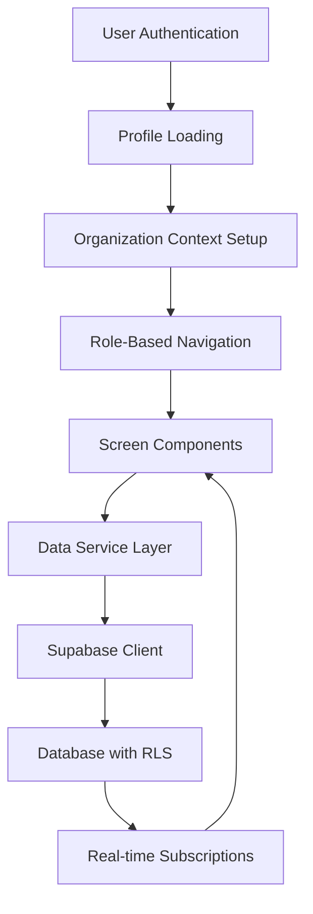

# Dynamic Data Integration Design

## Overview

This design document outlines the architecture for replacing all static data with dynamic Supabase data across the NHS/NHSA mobile application. The solution focuses on creating a robust data layer that handles real-time fetching, caching, and synchronization while maintaining role-based access control and organization isolation.

## Architecture

### Data Flow Architecture



### Core Components

1. **Enhanced Data Services**: Centralized services for each data domain (users, events, attendance, volunteer hours)
2. **React Query Integration**: Caching and synchronization layer for optimal performance
3. **Real-time Subscription Manager**: Handles live data updates across screens
4. **Type-Safe Schema Layer**: TypeScript interfaces matching Supabase schema
5. **Error Boundary System**: Graceful error handling and recovery

## Components and Interfaces

### Data Service Layer

#### UserDataService
```typescript
interface UserDataService {
  getCurrentUserProfile(): Promise<UserProfile>
  updateUserProfile(updates: Partial<UserProfile>): Promise<void>
  validateUserRole(userId: string): Promise<UserRole>
}
```

#### EventDataService
```typescript
interface EventDataService {
  getOrganizationEvents(orgId: string): Promise<Event[]>
  createEvent(event: CreateEventRequest): Promise<Event>
  updateEvent(eventId: string, updates: Partial<Event>): Promise<void>
  deleteEvent(eventId: string): Promise<void>
}
```

#### VolunteerHoursService
```typescript
interface VolunteerHoursService {
  getUserVolunteerHours(userId: string): Promise<VolunteerHour[]>
  submitVolunteerHours(hours: CreateVolunteerHourRequest): Promise<void>
  approveVolunteerHours(hourId: string): Promise<void>
  getPendingApprovals(orgId: string): Promise<VolunteerHour[]>
}
```

#### AttendanceService
```typescript
interface AttendanceService {
  getUserAttendance(userId: string): Promise<AttendanceRecord[]>
  markAttendance(eventId: string, userId: string): Promise<void>
  getEventAttendance(eventId: string): Promise<AttendanceRecord[]>
}
```

### React Query Hooks

#### Custom Hooks for Data Fetching
```typescript
// User data hooks
const useUserProfile = () => useQuery(['userProfile'], UserDataService.getCurrentUserProfile)
const useUserRole = () => useQuery(['userRole'], UserDataService.validateUserRole)

// Event data hooks
const useOrganizationEvents = (orgId: string) => 
  useQuery(['events', orgId], () => EventDataService.getOrganizationEvents(orgId))

// Volunteer hours hooks
const useUserVolunteerHours = (userId: string) =>
  useQuery(['volunteerHours', userId], () => VolunteerHoursService.getUserVolunteerHours(userId))

// Attendance hooks
const useUserAttendance = (userId: string) =>
  useQuery(['attendance', userId], () => AttendanceService.getUserAttendance(userId))
```

### Real-time Subscription System

#### Subscription Manager
```typescript
interface SubscriptionManager {
  subscribeToEvents(orgId: string, callback: (events: Event[]) => void): () => void
  subscribeToVolunteerHours(userId: string, callback: (hours: VolunteerHour[]) => void): () => void
  subscribeToAttendance(userId: string, callback: (attendance: AttendanceRecord[]) => void): () => void
  unsubscribeAll(): void
}
```

## Data Models

### Enhanced Type Definitions

```typescript
interface UserProfile {
  id: string
  email: string
  full_name: string
  role: 'member' | 'officer'
  org_id: string
  organization: Organization
  created_at: string
  updated_at: string
}

interface Event {
  id: string
  title: string
  description: string
  date: string
  location: string
  org_id: string
  created_by: string
  max_attendees?: number
  volunteer_hours?: number
  created_at: string
  updated_at: string
}

interface VolunteerHour {
  id: string
  user_id: string
  event_id?: string
  hours: number
  description: string
  date: string
  status: 'pending' | 'approved' | 'rejected'
  approved_by?: string
  org_id: string
  created_at: string
  updated_at: string
}

interface AttendanceRecord {
  id: string
  user_id: string
  event_id: string
  attended: boolean
  check_in_time?: string
  org_id: string
  created_at: string
  updated_at: string
}
```

### Screen-Specific Data Requirements

#### Member Screens
- **MemberDashboard**: User profile, recent events, volunteer hour summary
- **MemberEventsScreen**: Organization events with attendance status
- **MemberVolunteerHoursForm**: User's volunteer hours with submission capability
- **MemberAttendanceScreen**: User's attendance history

#### Officer Screens
- **OfficerDashboard**: Organization statistics, pending approvals, recent activity
- **OfficerEventsScreen**: Full event management with creation/editing
- **OfficerVolunteerApprovalScreen**: Pending volunteer hour approvals
- **OfficerAttendanceScreen**: Event attendance management

## Error Handling

### Error Boundary Strategy

```typescript
interface ErrorBoundaryState {
  hasError: boolean
  errorType: 'network' | 'permission' | 'data' | 'unknown'
  errorMessage: string
  retryAction?: () => void
}
```

### Error Recovery Patterns

1. **Network Errors**: Automatic retry with exponential backoff
2. **Permission Errors**: Redirect to appropriate screen with explanation
3. **Data Errors**: Graceful degradation with partial data display
4. **Unknown Errors**: Generic error screen with support contact

### Loading States

```typescript
interface LoadingState {
  isLoading: boolean
  isError: boolean
  error?: Error
  data?: any
  refetch: () => void
}
```

## Testing Strategy

### Unit Testing Approach

1. **Data Service Testing**: Mock Supabase client responses
2. **Hook Testing**: Test React Query integration with mock data
3. **Component Testing**: Verify proper data rendering and loading states
4. **Error Handling Testing**: Simulate various error conditions

### Integration Testing

1. **End-to-End Data Flow**: Test complete user journeys with real data
2. **Role-Based Access**: Verify proper data filtering by role and organization
3. **Real-time Updates**: Test subscription and data synchronization
4. **Performance Testing**: Measure data loading times and memory usage

### Test Data Strategy

```typescript
interface TestDataFactory {
  createMockUser(role: 'member' | 'officer'): UserProfile
  createMockEvent(orgId: string): Event
  createMockVolunteerHour(userId: string): VolunteerHour
  createMockAttendance(userId: string, eventId: string): AttendanceRecord
}
```

## Performance Considerations

### Caching Strategy

1. **React Query Cache**: 5-minute stale time for static data, 30 seconds for dynamic data
2. **Background Refetch**: Automatic data refresh when app comes to foreground
3. **Optimistic Updates**: Immediate UI updates with server reconciliation
4. **Selective Invalidation**: Targeted cache invalidation based on data relationships

### Data Loading Optimization

1. **Lazy Loading**: Load data only when screens are accessed
2. **Pagination**: Implement cursor-based pagination for large datasets
3. **Prefetching**: Preload likely-to-be-accessed data
4. **Compression**: Use Supabase's built-in response compression

### Memory Management

1. **Subscription Cleanup**: Automatic unsubscription on component unmount
2. **Cache Size Limits**: Configure React Query cache limits
3. **Image Optimization**: Lazy load and cache event/profile images
4. **Background Processing**: Handle data processing in background threads

## Security Considerations

### Data Access Control

1. **RLS Enforcement**: All queries automatically filtered by organization
2. **Role Validation**: Server-side role verification for sensitive operations
3. **Input Sanitization**: Validate all user inputs before database operations
4. **Audit Logging**: Track all data modifications for security monitoring

### Authentication Integration

1. **Token Refresh**: Automatic JWT token refresh handling
2. **Session Validation**: Periodic session validity checks
3. **Logout Handling**: Proper cleanup of cached data on logout
4. **Offline Security**: Secure local data storage for offline scenarios

## Migration Strategy

### Phase 1: Core Data Services
1. Implement base data services for each domain
2. Create TypeScript interfaces matching database schema
3. Set up React Query configuration and error boundaries

### Phase 2: Screen-by-Screen Migration
1. Start with member screens (lower complexity)
2. Replace static data with dynamic hooks
3. Implement loading and error states
4. Add real-time subscriptions

### Phase 3: Officer Screen Enhancement
1. Migrate officer screens with administrative features
2. Implement complex data relationships
3. Add bulk operations and advanced filtering

### Phase 4: Optimization and Polish
1. Implement performance optimizations
2. Add comprehensive error recovery
3. Enhance real-time synchronization
4. Complete testing coverage

## Rollback Plan

### Safe Deployment Strategy

1. **Feature Flags**: Toggle between static and dynamic data
2. **Gradual Rollout**: Enable dynamic data for percentage of users
3. **Monitoring**: Track error rates and performance metrics
4. **Quick Rollback**: Immediate fallback to static data if issues arise

### Data Consistency Checks

1. **Schema Validation**: Verify database schema matches TypeScript interfaces
2. **Data Integrity**: Check for missing or corrupted data before migration
3. **Permission Verification**: Validate RLS policies work correctly
4. **Performance Baseline**: Establish performance benchmarks before changes