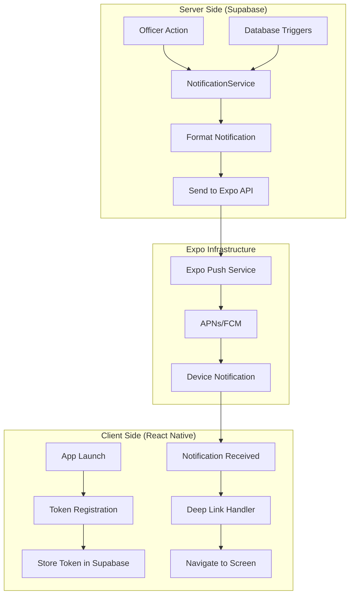

# Design Document

## Overview

This design document outlines the implementation of a comprehensive push notification system for the NHS app using Expo's built-in push notification service. The system will provide cross-platform notifications for iOS and Android with a unified API, reusable notification services, and robust error handling.

The design leverages Expo's push notification infrastructure to eliminate the complexity of managing APNs and FCM directly, while providing a scalable foundation for all notification types in the NHS app.

## Architecture

### High-Level Architecture



### System Components

1. **Client-Side Components**
   - Token Registration Service
   - Notification Handler
   - Deep Link Router
   - Permission Manager

2. **Server-Side Components**
   - NotificationService (unified API)
   - Notification Formatters
   - Database Triggers
   - Rate Limiting Service

3. **External Services**
   - Expo Push Notification API
   - Supabase Database
   - APNs/FCM (managed by Expo)

## Components and Interfaces

### 1. Push Token Management

#### Token Registration Service
```typescript
interface PushTokenService {
  registerToken(): Promise<string | null>
  updateTokenInDatabase(token: string, userId: string): Promise<void>
  validateToken(token: string): boolean
  removeInvalidToken(token: string): Promise<void>
}
```

**Implementation Location**: `src/services/PushTokenService.ts`

**Key Features**:
- Automatic token registration on app launch
- Token validation and cleanup
- Cross-platform token handling
- Secure token storage in Supabase

#### Permission Management
```typescript
interface NotificationPermissionService {
  requestPermissions(): Promise<boolean>
  checkPermissionStatus(): Promise<PermissionStatus>
  handlePermissionDenied(): void
  setupNotificationChannels(): Promise<void> // Android only
}
```

**Implementation Location**: `src/services/NotificationPermissionService.ts`

### 2. Notification Service Layer

#### Core Notification Service
```typescript
interface NotificationService {
  sendAnnouncement(announcement: AnnouncementData): Promise<void>
  sendEventNotification(event: EventData): Promise<void>
  sendVolunteerHoursUpdate(request: VolunteerHoursData, status: 'approved' | 'rejected'): Promise<void>
  sendBLESessionNotification(session: BLESessionData): Promise<void>
  sendBatchNotifications(notifications: NotificationPayload[]): Promise<void>
}
```

**Implementation Location**: `src/services/NotificationService.ts`

#### Notification Payload Interface
```typescript
interface NotificationPayload {
  to: string | string[]
  title: string
  body: string
  data: {
    type: 'announcement' | 'event' | 'volunteer_hours' | 'ble_session'
    itemId: string
    orgId: string
    priority: 'high' | 'normal'
    [key: string]: any
  }
  sound?: 'default' | null
  badge?: number
  priority?: 'high' | 'normal' | 'low'
}
```

### 3. Notification Formatters

#### Announcement Formatter
```typescript
interface AnnouncementFormatter {
  formatTitle(announcement: AnnouncementData): string
  formatBody(announcement: AnnouncementData): string
  formatData(announcement: AnnouncementData): NotificationData
}
```

**Example Implementation**:
```typescript
class AnnouncementFormatter implements AnnouncementFormatter {
  formatTitle(announcement: AnnouncementData): string {
    return `New Announcement: ${announcement.title}`
  }
  
  formatBody(announcement: AnnouncementData): string {
    return announcement.content.substring(0, 100) + (announcement.content.length > 100 ? '...' : '')
  }
  
  formatData(announcement: AnnouncementData): NotificationData {
    return {
      type: 'announcement',
      itemId: announcement.id,
      orgId: announcement.org_id,
      priority: 'normal'
    }
  }
}
```

### 4. Deep Link Navigation

#### Navigation Handler
```typescript
interface NotificationNavigationHandler {
  handleNotificationTap(data: NotificationData): void
  navigateToAnnouncement(announcementId: string): void
  navigateToEvent(eventId: string): void
  navigateToVolunteerHours(requestId: string): void
  navigateToBLESession(): void
}
```

**Implementation Location**: `src/services/NotificationNavigationHandler.ts`

### 5. Rate Limiting and Spam Prevention

#### Rate Limiter Service
```typescript
interface RateLimiterService {
  checkAnnouncementLimit(orgId: string, officerId: string): Promise<boolean>
  checkDuplicateNotification(type: string, itemId: string): Promise<boolean>
  batchVolunteerHoursApprovals(approvals: VolunteerHoursApproval[]): Promise<NotificationPayload[]>
  temporaryMute(userId: string, duration: MuteDuration): Promise<void>
}
```

## Data Models

### Database Schema Extensions

#### Push Tokens Table
```sql
-- Add to existing profiles table
ALTER TABLE profiles ADD COLUMN expo_push_token TEXT;
ALTER TABLE profiles ADD COLUMN notifications_enabled BOOLEAN DEFAULT true;
ALTER TABLE profiles ADD COLUMN notification_preferences JSONB DEFAULT '{}';
ALTER TABLE profiles ADD COLUMN muted_until TIMESTAMP WITH TIME ZONE;
```

#### Notification History Table (Optional)
```sql
CREATE TABLE notification_history (
  id UUID PRIMARY KEY DEFAULT gen_random_uuid(),
  user_id UUID REFERENCES auth.users(id),
  org_id UUID REFERENCES organizations(id),
  notification_type TEXT NOT NULL,
  title TEXT NOT NULL,
  body TEXT NOT NULL,
  data JSONB,
  sent_at TIMESTAMP WITH TIME ZONE DEFAULT NOW(),
  delivery_status TEXT DEFAULT 'sent',
  read_at TIMESTAMP WITH TIME ZONE
);
```

#### Rate Limiting Table
```sql
CREATE TABLE notification_rate_limits (
  id UUID PRIMARY KEY DEFAULT gen_random_uuid(),
  org_id UUID REFERENCES organizations(id),
  officer_id UUID REFERENCES auth.users(id),
  notification_type TEXT NOT NULL,
  count INTEGER DEFAULT 1,
  window_start TIMESTAMP WITH TIME ZONE DEFAULT NOW(),
  UNIQUE(org_id, officer_id, notification_type, window_start)
);
```

### Notification Preferences Schema
```typescript
interface NotificationPreferences {
  announcements: boolean
  events: boolean
  volunteer_hours: boolean
  ble_sessions: boolean
  custom_notifications: boolean
  quiet_hours: {
    enabled: boolean
    start_time: string // "22:00"
    end_time: string   // "08:00"
  }
}
```

## Error Handling

### Error Types and Responses

#### Token Management Errors
```typescript
enum TokenError {
  PERMISSION_DENIED = 'permission_denied',
  TOKEN_INVALID = 'token_invalid',
  REGISTRATION_FAILED = 'registration_failed',
  DEVICE_NOT_SUPPORTED = 'device_not_supported'
}
```

#### Notification Delivery Errors
```typescript
enum DeliveryError {
  DEVICE_NOT_REGISTERED = 'DeviceNotRegistered',
  MESSAGE_TOO_BIG = 'MessageTooBig',
  MESSAGE_RATE_EXCEEDED = 'MessageRateExceeded',
  INVALID_CREDENTIALS = 'InvalidCredentials'
}
```

### Error Handling Strategy

1. **Graceful Degradation**: App continues to function even if notifications fail
2. **Automatic Retry**: Failed notifications are retried with exponential backoff
3. **Token Cleanup**: Invalid tokens are automatically removed from database
4. **User Feedback**: Clear error messages for permission issues
5. **Logging**: Comprehensive error logging for debugging

### Error Recovery Mechanisms

```typescript
class NotificationErrorHandler {
  async handleDeliveryError(error: DeliveryError, token: string): Promise<void> {
    switch (error) {
      case DeliveryError.DEVICE_NOT_REGISTERED:
        await this.removeInvalidToken(token)
        break
      case DeliveryError.MESSAGE_RATE_EXCEEDED:
        await this.scheduleRetry(token, 60000) // Retry in 1 minute
        break
      case DeliveryError.MESSAGE_TOO_BIG:
        await this.truncateAndRetry(token)
        break
    }
  }
}
```

## Testing Strategy

### Unit Testing

#### Test Coverage Areas
1. **Token Registration**: Mock Expo APIs and test token handling
2. **Notification Formatting**: Test all notification formatters
3. **Rate Limiting**: Test limits and spam prevention
4. **Deep Link Navigation**: Test navigation logic
5. **Error Handling**: Test all error scenarios

#### Mock Strategy
```typescript
// Mock Expo Notifications for testing
jest.mock('expo-notifications', () => ({
  getExpoPushTokenAsync: jest.fn(),
  requestPermissionsAsync: jest.fn(),
  setNotificationHandler: jest.fn(),
  addNotificationReceivedListener: jest.fn(),
  addNotificationResponseReceivedListener: jest.fn()
}))
```

### Integration Testing

#### Test Scenarios
1. **End-to-End Notification Flow**: Officer creates announcement → Members receive notification → Tap navigation works
2. **Cross-Platform Testing**: Verify notifications work on both iOS and Android
3. **Permission Handling**: Test permission request and denial scenarios
4. **Rate Limiting**: Test that limits are enforced correctly
5. **Error Recovery**: Test invalid token cleanup and retry mechanisms

### Physical Device Testing Requirements

#### iOS Testing
- Test on physical iPhone (iOS 13+)
- Verify APNs integration through Expo
- Test notification permissions
- Test deep linking from notifications
- Test background/foreground notification handling

#### Android Testing
- Test on physical Android device (API 21+)
- Verify FCM integration through Expo
- Test notification channels
- Test deep linking from notifications
- Test background/foreground notification handling

### Testing Tools and Utilities

#### Expo Push Notification Tool
- Use https://expo.dev/notifications for manual testing
- Validate token format and delivery
- Test notification payload structure

#### Automated Testing Scripts
```typescript
// Test notification delivery
async function testNotificationDelivery(token: string): Promise<boolean> {
  const testPayload = {
    to: token,
    title: 'Test Notification',
    body: 'This is a test notification',
    data: { type: 'test', itemId: 'test-123' }
  }
  
  const result = await sendPushNotification(testPayload)
  return result.data?.[0]?.status === 'ok'
}
```

## Performance Considerations

### Optimization Strategies

#### Batch Processing
- Group notifications by organization
- Send up to 100 notifications per batch request
- Implement queue system for large notification volumes

#### Caching Strategy
```typescript
interface NotificationCache {
  getUserTokens(orgId: string): Promise<string[]>
  cacheTokens(orgId: string, tokens: string[], ttl: number): void
  invalidateCache(orgId: string): void
}
```

#### Database Optimization
- Index on `expo_push_token` for fast lookups
- Index on `org_id` and `notifications_enabled` for batch queries
- Use database functions for complex notification logic

### Scalability Considerations

#### Horizontal Scaling
- Notification service can be deployed as separate microservice
- Use message queues for high-volume notification processing
- Implement database connection pooling

#### Rate Limiting Implementation
```typescript
class DatabaseRateLimiter {
  async checkLimit(orgId: string, type: string, limit: number, windowMinutes: number): Promise<boolean> {
    const result = await supabase.rpc('check_notification_rate_limit', {
      org_id: orgId,
      notification_type: type,
      rate_limit: limit,
      window_minutes: windowMinutes
    })
    
    return result.data?.allowed || false
  }
}
```

## Security Considerations

### Token Security
- Store tokens encrypted in database
- Implement token rotation mechanism
- Validate token format before storage
- Use HTTPS for all token transmission

### Access Control
- Verify officer permissions before sending notifications
- Implement organization-level isolation
- Rate limit per officer and organization
- Audit log for all notification activities

### Data Privacy
- Minimize sensitive data in notification payloads
- Use deep links instead of including full content
- Respect user notification preferences
- Implement data retention policies for notification history

### Spam Prevention
```typescript
interface SpamPreventionService {
  validateNotificationContent(content: string): boolean
  checkSenderReputation(officerId: string): Promise<boolean>
  detectDuplicateContent(content: string, timeWindow: number): Promise<boolean>
  quarantineSpammer(officerId: string): Promise<void>
}
```

## Implementation Phases

### Phase 1: Core Infrastructure (Week 1)
- Token registration and management
- Basic notification service
- Permission handling
- Database schema updates

### Phase 2: Notification Types (Week 2)
- Announcement notifications
- Event notifications
- Volunteer hours notifications
- Basic deep linking

### Phase 3: Advanced Features (Week 3)
- BLE session notifications
- Rate limiting and spam prevention
- Notification preferences
- Error handling and recovery

### Phase 4: Testing and Optimization (Week 4)
- Comprehensive testing on physical devices
- Performance optimization
- Security audit
- Documentation and deployment

## Monitoring and Analytics

### Key Metrics
- Notification delivery rate
- User engagement (tap-through rate)
- Permission grant rate
- Error rates by type
- Performance metrics (latency, throughput)

### Logging Strategy
```typescript
interface NotificationLogger {
  logTokenRegistration(userId: string, token: string): void
  logNotificationSent(payload: NotificationPayload, recipients: number): void
  logNotificationError(error: Error, context: any): void
  logUserEngagement(userId: string, notificationType: string, action: 'tap' | 'dismiss'): void
}
```

### Health Checks
- Monitor Expo API availability
- Check database connection health
- Validate token registration rates
- Alert on high error rates

This design provides a comprehensive foundation for implementing push notifications in the NHS app while maintaining scalability, reliability, and user experience standards.