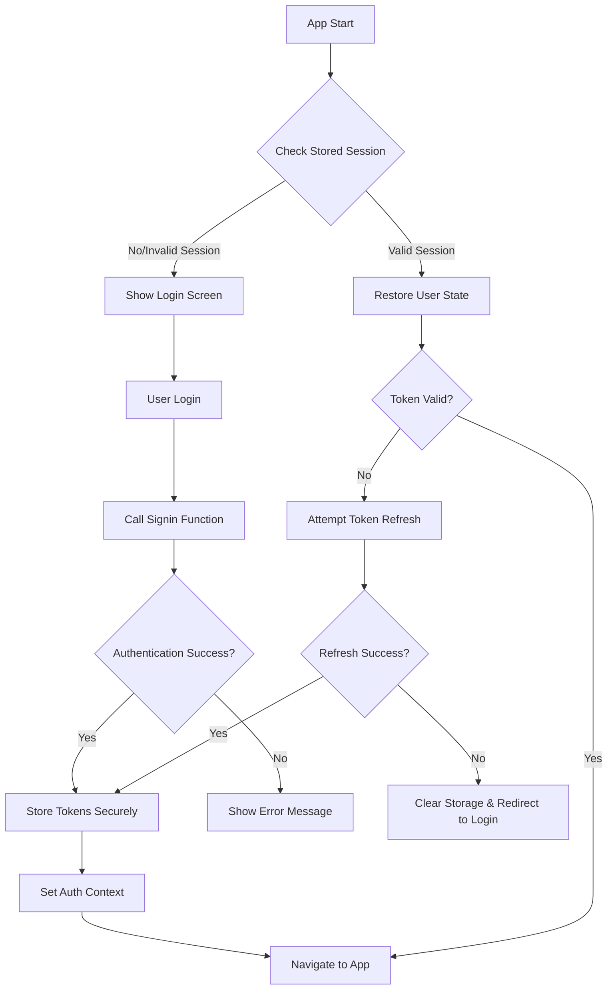
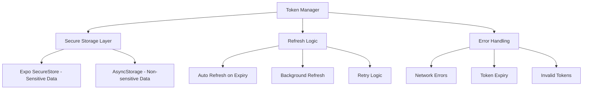

# JWT Authentication Fix Design Document

## Overview

This design document outlines the comprehensive solution for fixing JWT authentication issues in the React Native app. The solution addresses refresh token errors, implements proper session persistence, fixes profile button functionality, ensures universal profile access, and clarifies password security practices.

## Architecture

### Authentication Flow Architecture



### Token Management Architecture



## Components and Interfaces

### 1. Enhanced Authentication Context

**Purpose:** Centralized authentication state management with robust token handling

**Key Features:**
- Automatic token refresh
- Secure token storage
- Session persistence
- Error handling and recovery

**Interface:**
```typescript
interface AuthContextType {
  session: Session | null;
  user: User | null;
  profile: Profile | null;
  isLoading: boolean;
  isInitialized: boolean;
  error: string | null;
  signOut: () => Promise<void>;
  refreshProfile: () => Promise<void>;
  clearError: () => void;
  refreshSession: () => Promise<boolean>;
}
```

### 2. Token Manager Service

**Purpose:** Handles all token-related operations including storage, refresh, and validation

**Key Features:**
- Secure token storage using Expo SecureStore
- Automatic token refresh with retry logic
- Token validation and expiry checking
- Graceful error handling

**Interface:**
```typescript
interface TokenManager {
  storeTokens(session: Session): Promise<void>;
  getStoredSession(): Promise<Session | null>;
  refreshTokens(): Promise<Session | null>;
  clearTokens(): Promise<void>;
  isTokenExpired(token: string): boolean;
  validateSession(session: Session): boolean;
}
```

### 3. Enhanced Profile Button Component

**Purpose:** Consistent profile access across all screens with reliable functionality

**Key Features:**
- Universal accessibility from any screen
- Consistent modal behavior
- Proper state management
- Error handling for profile operations

**Interface:**
```typescript
interface ProfileButtonProps {
  color?: string;
  size?: number;
  style?: any;
  onProfileUpdate?: () => void;
}
```

### 4. Session Persistence Service

**Purpose:** Manages session data persistence and restoration

**Key Features:**
- Secure storage of session data
- Automatic session restoration on app start
- Data validation and corruption handling
- Clean session cleanup on logout

**Interface:**
```typescript
interface SessionPersistence {
  saveSession(session: Session, profile: Profile): Promise<void>;
  restoreSession(): Promise<{session: Session | null, profile: Profile | null}>;
  clearSession(): Promise<void>;
  validateStoredData(): Promise<boolean>;
}
```

## Data Models

### Enhanced Session Model
```typescript
interface EnhancedSession {
  access_token: string;
  refresh_token: string;
  expires_at: number;
  expires_in: number;
  token_type: string;
  user: User;
  stored_at: number; // Timestamp when stored
  last_refreshed?: number; // Last refresh timestamp
}
```

### Storage Keys Configuration
```typescript
const STORAGE_KEYS = {
  ACCESS_TOKEN: 'auth_access_token',
  REFRESH_TOKEN: 'auth_refresh_token',
  SESSION_DATA: 'auth_session_data',
  USER_PROFILE: 'user_profile',
  LAST_REFRESH: 'last_token_refresh'
} as const;
```

### Error Types
```typescript
enum AuthErrorType {
  NETWORK_ERROR = 'NETWORK_ERROR',
  TOKEN_EXPIRED = 'TOKEN_EXPIRED',
  INVALID_CREDENTIALS = 'INVALID_CREDENTIALS',
  REFRESH_FAILED = 'REFRESH_FAILED',
  STORAGE_ERROR = 'STORAGE_ERROR',
  PROFILE_FETCH_ERROR = 'PROFILE_FETCH_ERROR'
}
```

## Error Handling

### Token Refresh Error Handling Strategy

1. **Automatic Retry Logic:**
   - Implement exponential backoff for token refresh attempts
   - Maximum 3 retry attempts with increasing delays
   - Fallback to logout if all attempts fail

2. **Network Error Handling:**
   - Detect network connectivity issues
   - Queue refresh attempts when network is restored
   - Show appropriate user feedback for network issues

3. **Invalid Token Handling:**
   - Immediately clear invalid tokens from storage
   - Redirect to login screen with appropriate message
   - Log security events for monitoring

### Profile Button Error Recovery

1. **Modal State Recovery:**
   - Reset modal state on authentication changes
   - Implement proper cleanup on component unmount
   - Handle edge cases in modal visibility

2. **Profile Data Errors:**
   - Graceful fallback when profile data is unavailable
   - Retry profile fetch with exponential backoff
   - Show loading states during profile operations

## Testing Strategy

### Unit Tests

1. **Token Manager Tests:**
   - Token storage and retrieval
   - Token validation logic
   - Refresh token functionality
   - Error handling scenarios

2. **Authentication Context Tests:**
   - State management
   - Session restoration
   - Error propagation
   - Cleanup operations

3. **Profile Component Tests:**
   - Modal functionality
   - User interaction handling
   - Error state rendering
   - Accessibility compliance

### Integration Tests

1. **Authentication Flow Tests:**
   - Complete login/logout cycles
   - Session persistence across app restarts
   - Token refresh scenarios
   - Error recovery flows

2. **Profile Access Tests:**
   - Profile button functionality across screens
   - Modal behavior consistency
   - Logout functionality from different screens
   - State synchronization

### Security Tests

1. **Token Security Tests:**
   - Secure storage validation
   - Token transmission security
   - Storage cleanup verification
   - Encryption validation

2. **Session Security Tests:**
   - Session hijacking prevention
   - Token expiry enforcement
   - Secure logout implementation
   - Data sanitization

## Password Security and Admin Access

### Password Storage Architecture

**Supabase Authentication System:**
- Passwords are hashed using industry-standard algorithms (bcrypt with salt)
- Passwords are never stored in plain text
- Hash verification is handled by Supabase Auth service
- No direct database access to password hashes

### Admin User Management

**Proper Admin Access Methods:**

1. **Supabase Dashboard:**
   - Access user management through Supabase dashboard
   - View user accounts, roles, and metadata
   - Disable/enable user accounts
   - Reset user passwords through email

2. **Admin API Functions:**
   - Create admin-only Edge Functions for user management
   - Implement proper role-based access control
   - Use service role key for admin operations
   - Audit all admin actions

3. **Password Reset Process:**
   - Users can reset passwords via email
   - Admins can trigger password reset emails
   - No direct password access for admins
   - All resets are logged and auditable

**Security Best Practices:**
- Never access auth.users table directly
- Use Supabase Auth API for all user operations
- Implement proper admin role verification
- Log all administrative actions
- Use environment-specific admin access

### User Management Procedures

1. **Creating Users:**
   - Use signup function or admin invite system
   - Set appropriate roles and permissions
   - Send welcome emails with setup instructions

2. **Resetting Passwords:**
   - Use Supabase password reset functionality
   - Send reset emails to user's registered email
   - Verify user identity before reset

3. **Managing User Roles:**
   - Update user profiles through admin functions
   - Implement role change approval workflows
   - Audit role changes for compliance

## Implementation Considerations

### Performance Optimizations

1. **Token Refresh Optimization:**
   - Implement token refresh queuing to prevent multiple simultaneous requests
   - Cache refresh results to avoid redundant API calls
   - Use background refresh to minimize user impact

2. **Storage Optimization:**
   - Minimize data stored in SecureStore (only sensitive tokens)
   - Use AsyncStorage for non-sensitive session data
   - Implement data compression for large profile objects

### Security Considerations

1. **Token Security:**
   - Use Expo SecureStore for access and refresh tokens
   - Implement token rotation on each refresh
   - Clear tokens immediately on logout or app uninstall

2. **Network Security:**
   - Enforce HTTPS for all authentication requests
   - Implement certificate pinning for production
   - Use proper CORS configuration

3. **Data Protection:**
   - Encrypt sensitive data before storage
   - Implement proper data sanitization
   - Use secure random generation for session IDs

### Accessibility and User Experience

1. **Error Messages:**
   - Provide clear, actionable error messages
   - Support screen readers and accessibility tools
   - Implement proper error recovery flows

2. **Loading States:**
   - Show appropriate loading indicators
   - Implement skeleton screens for better UX
   - Provide feedback for long-running operations

3. **Offline Support:**
   - Handle offline scenarios gracefully
   - Queue authentication operations when offline
   - Provide offline indicators and messaging