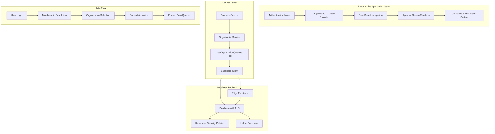
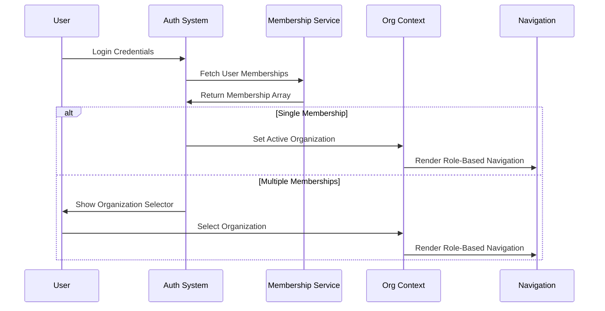

# Multi-Organization Application Integration Design

## Overview

This design document outlines the comprehensive integration of the multi-organization database security system with the React Native application layer. The system transforms all screens from static placeholders to dynamic, organization-scoped interfaces that enforce strict data isolation between NHS and NHSA while supporting flexible multi-role user accounts.

The architecture leverages the existing UUID-based database schema with Row-Level Security (RLS) policies to provide seamless, secure, and role-appropriate user experiences. The design ensures complete organizational isolation while allowing users to hold multiple memberships across different organizations with appropriate role restrictions.

## Architecture

### High-Level System Architecture



### Core Design Principles

1. **Strict Data Isolation**: Every query, component, and navigation element is scoped by org_id
2. **Role-Based Access Control**: UI and functionality adapt dynamically based on user role
3. **Multi-Organization Support**: Users can hold memberships in multiple organizations with appropriate restrictions
4. **Security-First Approach**: Database-level RLS provides ultimate protection with application-level enforcement
5. **Atomic Operations**: Critical operations use Edge Functions for secure, transactional execution

## Components and Interfaces

### 1. Organization Context System

#### OrganizationContext Provider
```typescript
interface OrganizationContextType {
  activeOrganization: Organization | null;
  userMemberships: Membership[];
  switchOrganization: (orgId: string) => Promise<void>;
  currentRole: UserRole | null;
  isOfficer: boolean;
  isMember: boolean;
}
```

**Responsibilities:**
- Manage active organization state
- Handle organization switching
- Provide role-based access information
- Trigger context refresh on organization changes

#### Organization Selector Component
```typescript
interface OrganizationSelectorProps {
  memberships: Membership[];
  onSelect: (orgId: string) => void;
  currentOrgId?: string;
}
```

**Responsibilities:**
- Display available organizations for multi-membership users
- Handle organization selection during login
- Provide visual indication of current active organization

### 2. Authentication and Membership System

#### Enhanced Authentication Flow


#### Membership Validation System
```typescript
interface MembershipValidator {
  validateNewMembership(
    email: string,
    studentId: string,
    orgId: string,
    role: UserRole
  ): Promise<ValidationResult>;
  
  checkExistingMemberships(
    email: string,
    studentId: string
  ): Promise<Membership[]>;
  
  enforceRoleRestrictions(
    existingMemberships: Membership[],
    newRole: UserRole,
    newOrgId: string
  ): boolean;
}
```

### 3. Role-Based Navigation System

#### Navigation Provider
```typescript
interface NavigationConfig {
  role: UserRole;
  screens: ScreenConfig[];
  permissions: PermissionSet;
}

interface ScreenConfig {
  name: string;
  component: React.ComponentType;
  requiredRole: UserRole[];
  requiredPermissions?: string[];
}
```

#### Role-Specific Screen Sets

**Officer Navigation:**
- Dashboard (Officer)
- Event Management
- Volunteer Hour Approvals
- Attendance Control
- Verification Management
- Member Management
- File Management

**Member Navigation:**
- Dashboard (Member)
- Events (View Only)
- Volunteer Hours (Submit/View)
- Attendance (View Only)
- Files (Personal/Public)

### 4. Dynamic Screen Rendering System

#### Screen Factory Pattern
```typescript
interface ScreenFactory {
  createDashboard(role: UserRole, orgId: string): React.ComponentType;
  createEventScreen(role: UserRole, orgId: string): React.ComponentType;
  createVolunteerScreen(role: UserRole, orgId: string): React.ComponentType;
}
```

#### Component Permission Wrapper
```typescript
interface PermissionWrapperProps {
  requiredRole?: UserRole[];
  requiredPermissions?: string[];
  fallback?: React.ComponentType;
  children: React.ReactNode;
}
```

### 5. Data Service Layer

#### Enhanced DatabaseService
```typescript
interface DatabaseService {
  // Organization-scoped queries
  getOrganizationEvents(orgId: string): Promise<Event[]>;
  getOrganizationMembers(orgId: string): Promise<Profile[]>;
  getVolunteerHours(orgId: string, userId?: string): Promise<VolunteerHour[]>;
  
  // Role-based operations
  approveVolunteerHours(hourId: string, approved: boolean): Promise<void>;
  createEvent(event: CreateEventInput, orgId: string): Promise<Event>;
  manageAttendance(eventId: string, attendees: string[]): Promise<void>;
}
```

#### OrganizationService Integration
```typescript
interface OrganizationService {
  resolveOrganizationSlug(slug: string): Promise<string>; // Returns UUID
  getUserMemberships(userId: string): Promise<Membership[]>;
  switchActiveOrganization(orgId: string): Promise<void>;
  validateMembership(membershipData: MembershipInput): Promise<ValidationResult>;
}
```

### 6. Query Hook System

#### useOrganizationQueries Hook
```typescript
interface OrganizationQueries {
  events: UseQueryResult<Event[]>;
  members: UseQueryResult<Profile[]>;
  volunteerHours: UseQueryResult<VolunteerHour[]>;
  attendance: UseQueryResult<AttendanceRecord[]>;
  files: UseQueryResult<FileRecord[]>;
}

function useOrganizationQueries(orgId: string): OrganizationQueries;
```

**Auto-filtering Implementation:**
- All queries automatically include `.eq('org_id', orgId)`
- Real-time subscriptions scoped by organization
- Automatic query invalidation on organization switch

## Data Models

### Enhanced Type Definitions

#### Organization Model
```typescript
interface Organization {
  id: string; // UUID
  name: string;
  slug: string;
  type: 'NHS' | 'NHSA';
  settings: OrganizationSettings;
  created_at: string;
  updated_at: string;
}
```

#### Membership Model
```typescript
interface Membership {
  id: string;
  user_id: string;
  org_id: string; // UUID
  role: UserRole;
  status: 'active' | 'inactive' | 'pending';
  joined_at: string;
  organization: Organization;
}

type UserRole = 'member' | 'officer' | 'president' | 'vice_president' | 'admin';
```

#### Enhanced Profile Model
```typescript
interface Profile {
  id: string;
  user_id: string;
  email: string;
  student_id: string;
  first_name: string;
  last_name: string;
  memberships: Membership[];
  created_at: string;
  updated_at: string;
}
```

### Data Validation Rules

#### Multi-Organization Membership Logic
```typescript
interface MembershipRules {
  // A user can only be a "member" in one organization at a time
  singleMemberRole: boolean;
  
  // Officers can hold positions in multiple organizations
  multipleOfficerRoles: boolean;
  
  // Freshman (NHSA) and upperclassmen (NHS) separation
  gradeBasedOrganization: boolean;
}
```

## Error Handling

### Validation Error Types
```typescript
interface ValidationError {
  type: 'DUPLICATE_MEMBERSHIP' | 'INVALID_ROLE_COMBINATION' | 'ORGANIZATION_MISMATCH';
  message: string;
  details: Record<string, any>;
}
```

### Error Handling Strategy

1. **Client-Side Validation**: Immediate feedback for common validation errors
2. **Edge Function Validation**: Server-side enforcement of business rules
3. **Database Constraints**: Ultimate protection through RLS and constraints
4. **User-Friendly Messages**: Clear error communication in onboarding UI

### Error Recovery Patterns
- Graceful degradation for network issues
- Automatic retry for transient failures
- Clear user guidance for resolution steps
- Fallback to cached data when appropriate

## Testing Strategy

### Test Account Creation
```typescript
interface TestAccount {
  email: string;
  studentId: string;
  organizations: {
    orgId: string;
    role: UserRole;
  }[];
}

const testAccounts: TestAccount[] = [
  {
    email: "test@example.com",
    studentId: "12345",
    organizations: [
      { orgId: "nhs-rancho-bernardo-uuid", role: "officer" },
      { orgId: "nhsa-national-uuid", role: "member" }
    ]
  }
];
```

### Testing Scenarios

#### Data Isolation Testing
1. **Cross-Organization Data Access**: Verify NHS data never appears in NHSA context
2. **Role-Based Access**: Confirm members cannot access officer-only features
3. **Multi-Membership Validation**: Test organization switching and context isolation

#### Security Testing
1. **RLS Policy Validation**: Attempt unauthorized database access
2. **Edge Function Security**: Test business rule enforcement
3. **Permission Boundary Testing**: Verify UI and API permission alignment

#### Integration Testing
1. **End-to-End Workflows**: Complete user journeys for each role
2. **Organization Switching**: Multi-membership user experience
3. **Real-Time Updates**: Live data synchronization across contexts

### Test Data Population

#### Comprehensive Test Dataset
```typescript
interface TestDataSet {
  organizations: Organization[];
  profiles: Profile[];
  memberships: Membership[];
  events: Event[];
  volunteerHours: VolunteerHour[];
  files: FileRecord[];
}
```

**Data Requirements:**
- Multiple events per organization with different visibility settings
- Volunteer hour submissions in various states (pending, approved, rejected)
- File records with different access levels (public, organization, private)
- Realistic attendance and verification code data

## Edge Functions Integration

### Critical Edge Functions

#### 1. Membership Validation Function
```typescript
// /supabase/functions/validate-membership/index.ts
interface ValidateMembershipRequest {
  email: string;
  studentId: string;
  orgId: string;
  role: UserRole;
}
```

#### 2. Atomic Onboarding Function
```typescript
// /supabase/functions/onboard-user-atomic/index.ts
interface OnboardUserRequest {
  user_id: string;
  org_slug: string;
  role: UserRole;
  student_id: string;
}
```

#### 3. Volunteer Hour Approval Function
```typescript
// /supabase/functions/approve-volunteer-hours/index.ts
interface ApprovalRequest {
  hourId: string;
  approved: boolean;
  reason?: string;
  officerId: string;
}
```

#### 4. File Access Management Function
```typescript
// /supabase/functions/generate-presigned-url/index.ts
interface FileAccessRequest {
  fileId: string;
  operation: 'upload' | 'download';
  userId: string;
}
```

### Edge Function Security Model
- Service role context with RLS enforcement
- Input validation and sanitization
- Audit logging for sensitive operations
- Rate limiting and abuse prevention

## Implementation Phases

### Phase 1: Core Infrastructure
1. Organization Context Provider implementation
2. Enhanced authentication flow
3. Basic role-based navigation
4. Database service organization scoping

### Phase 2: Screen Integration
1. Dynamic screen rendering system
2. Component permission wrapper
3. Organization-scoped query hooks
4. Real-time data synchronization

### Phase 3: Advanced Features
1. Multi-organization membership support
2. Organization switching functionality
3. Edge function integration
4. Comprehensive permission system

### Phase 4: Testing and Validation
1. Test account creation and data population
2. Security and isolation testing
3. End-to-end workflow validation
4. Performance optimization and monitoring

## Security Considerations

### Defense in Depth Strategy
1. **Database Level**: RLS policies and constraints
2. **Service Level**: Edge function validation
3. **Application Level**: Context-based filtering
4. **UI Level**: Role-based component rendering

### Data Protection Measures
- UUID-based organization identification
- Encrypted sensitive data transmission
- Audit logging for administrative actions
- Regular security validation testing

### Compliance and Monitoring
- Continuous RLS policy effectiveness monitoring
- Regular security audit procedures
- Data access pattern analysis
- Incident response procedures

This design provides a comprehensive foundation for implementing the multi-organization system while maintaining strict security boundaries and providing flexible user experiences across NHS and NHSA contexts.