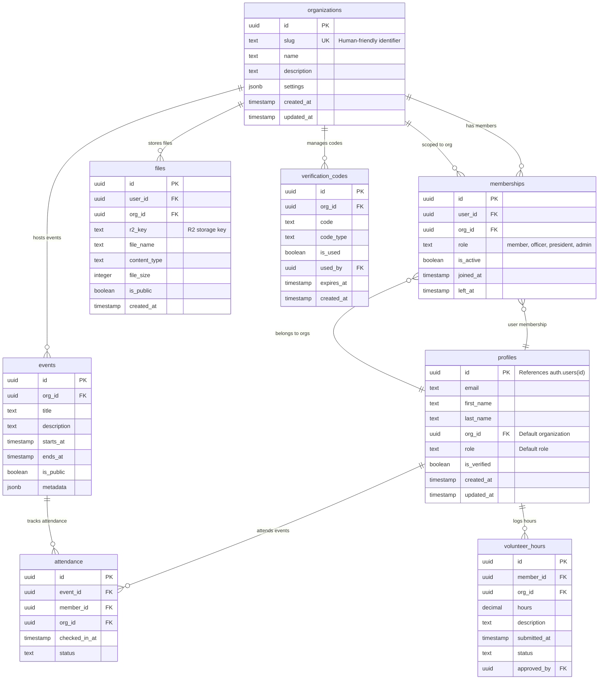
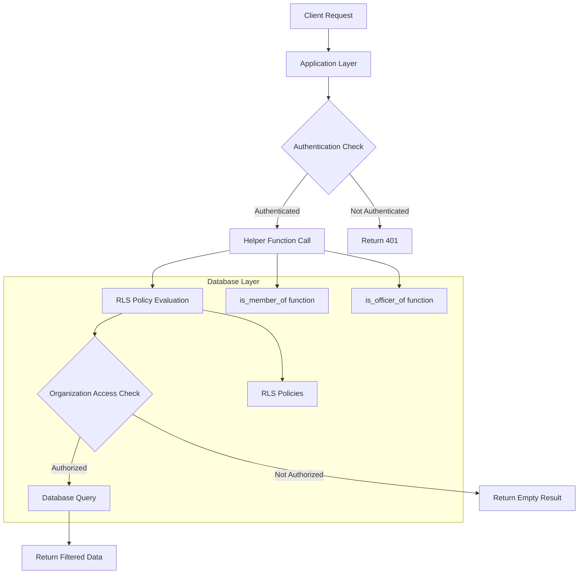

# Multi-Organization Database Security Design Document

## Overview

This design document outlines the comprehensive migration and modernization of the database schema to support secure multi-organization functionality with robust Row-Level Security (RLS). The system will transform the current database structure to enforce organization-level data isolation while maintaining member-level access controls through a production-ready, scalable database architecture.

The design leverages Supabase's PostgreSQL database with RLS policies, helper functions, and strategic indexing to create a secure multi-tenant system where NHS, NHSA, and future organizations can coexist safely within a single application codebase.

## Architecture

### Database Schema Architecture



### Security Architecture

The security model implements a three-tier approach:

1. **Schema-Level Security**: UUID foreign keys and NOT NULL constraints
2. **Row-Level Security**: PostgreSQL RLS policies on all organizational tables
3. **Application-Level Security**: Helper functions and consistent access patterns

### Data Flow Architecture



## Components and Interfaces

### Core Database Components

#### 1. Organizations Table
- **Primary Key**: `id` (UUID) with `gen_random_uuid()` default
- **Unique Constraint**: `slug` for human-friendly references
- **Purpose**: Central registry of all organizations (NHS, NHSA, future orgs)

#### 2. Memberships Table
- **Composite Key**: `(user_id, org_id)` with unique constraint
- **Role Management**: Centralized role assignment and validation
- **Audit Trail**: `joined_at`, `left_at`, `is_active` for historical tracking

#### 3. Helper Functions
```sql
-- Check if current user is member of organization
CREATE OR REPLACE FUNCTION public.is_member_of(p_org uuid) 
RETURNS boolean LANGUAGE sql STABLE AS $$
  SELECT EXISTS (
    SELECT 1 FROM memberships m
    WHERE m.user_id = auth.uid()::uuid
      AND m.org_id = p_org
      AND m.is_active = true
  );
$$;

-- Check if current user is officer of organization
CREATE OR REPLACE FUNCTION public.is_officer_of(p_org uuid) 
RETURNS boolean LANGUAGE sql STABLE AS $$
  SELECT EXISTS (
    SELECT 1 FROM memberships m
    WHERE m.user_id = auth.uid()::uuid
      AND m.org_id = p_org
      AND m.role IN ('officer', 'president', 'vice_president', 'admin')
      AND m.is_active = true
  );
$$;
```

### RLS Policy Framework

#### Policy Categories

1. **Self-Access Policies**: Users manage their own records
2. **Organization Member Policies**: Members view org-scoped data
3. **Organization Officer Policies**: Officers manage org data
4. **Public Access Policies**: Public content (events with `is_public = true`)
5. **Service Role Policies**: Administrative access for system operations

#### Policy Implementation Pattern

```sql
-- Example: Events table policies
CREATE POLICY "Public events readable" ON events
  FOR SELECT USING (is_public = true);

CREATE POLICY "Members view org events" ON events
  FOR SELECT USING (public.is_member_of(events.org_id));

CREATE POLICY "Officers manage org events" ON events
  FOR ALL USING (public.is_officer_of(events.org_id))
  WITH CHECK (public.is_officer_of(events.org_id));
```

### Migration Strategy Components

#### 1. Type Conversion System
- Safe UUID conversion for existing text-based org_id columns
- Conditional type checking to prevent errors on already-converted data
- Transaction-based rollback capability

#### 2. Foreign Key Management
- Systematic FK constraint addition after type conversion
- Appropriate CASCADE/SET NULL behavior based on data relationships
- Constraint validation before activation

#### 3. Data Integrity Validation
- Pre-migration data validation queries
- Post-migration verification procedures
- Orphaned record identification and cleanup

## Data Models

### Core Entity Models

#### Organization Model
```typescript
interface Organization {
  id: string;           // UUID primary key
  slug: string;         // Human-friendly identifier (nhs, nhsa)
  name: string;         // Display name
  description?: string; // Optional description
  settings: {           // Organization-specific configuration
    features: string[];
    branding: {
      primaryColor: string;
      logoUrl?: string;
    };
  };
  created_at: string;
  updated_at: string;
}
```

#### Membership Model
```typescript
interface Membership {
  id: string;
  user_id: string;      // References profiles.id
  org_id: string;       // References organizations.id
  role: 'member' | 'officer' | 'president' | 'vice_president' | 'admin';
  is_active: boolean;
  joined_at: string;
  left_at?: string;
}
```

#### Enhanced Profile Model
```typescript
interface Profile {
  id: string;           // References auth.users.id
  email: string;
  first_name?: string;
  last_name?: string;
  org_id?: string;      // Default organization (optional)
  role?: string;        // Default role (optional)
  is_verified: boolean;
  created_at: string;
  updated_at: string;
}
```

### Organizational Data Models

#### Event Model
```typescript
interface Event {
  id: string;
  org_id: string;       // Required organization scope
  title: string;
  description?: string;
  starts_at: string;
  ends_at: string;
  is_public: boolean;   // Controls cross-org visibility
  metadata: {
    location?: string;
    max_attendees?: number;
    requires_approval?: boolean;
  };
}
```

#### File Model
```typescript
interface File {
  id: string;
  user_id: string;      // File owner
  org_id: string;       // Organization scope
  r2_key: string;       // R2 storage identifier
  file_name: string;
  content_type: string;
  file_size: number;
  is_public: boolean;   // Public access flag
  created_at: string;
}
```

### Index Strategy Models

#### Performance Index Definitions
```sql
-- Organization-scoped queries
CREATE INDEX idx_events_org_starts ON events (org_id, starts_at);
CREATE INDEX idx_volunteer_org_member ON volunteer_hours (org_id, member_id);
CREATE INDEX idx_files_org_public ON files (org_id, is_public);

-- User-centric queries  
CREATE INDEX idx_memberships_user_org ON memberships (user_id, org_id);
CREATE INDEX idx_attendance_member_event ON attendance (member_id, event_id);

-- Administrative queries
CREATE INDEX idx_verification_codes_org_type ON verification_codes (org_id, code_type, is_used);
```

## Error Handling

### Migration Error Handling

#### Type Conversion Errors
```sql
-- Safe type conversion with error handling
DO $$ 
BEGIN
  IF (SELECT data_type FROM information_schema.columns 
      WHERE table_name = 'organizations' AND column_name = 'id') = 'text' THEN
    BEGIN
      ALTER TABLE organizations ALTER COLUMN id TYPE uuid USING id::uuid;
    EXCEPTION WHEN OTHERS THEN
      RAISE NOTICE 'Type conversion failed: %', SQLERRM;
      ROLLBACK;
    END;
  END IF;
END; 
$$ LANGUAGE plpgsql;
```

#### Foreign Key Constraint Errors
- Pre-validation of referential integrity
- Orphaned record identification and resolution
- Graceful constraint addition with error reporting

#### Data Migration Errors
- Transaction-based rollback on any failure
- Comprehensive logging of migration steps
- Backup schema creation for recovery

### Runtime Error Handling

#### RLS Policy Errors
- Graceful handling of unauthorized access attempts
- Consistent empty result sets for denied queries
- Audit logging of access violations

#### Helper Function Errors
- NULL handling for missing user context
- Default to most restrictive permissions on errors
- Performance optimization with STABLE function marking

#### Application Integration Errors
- Clear error messages for UUID conversion failures
- Validation of organization slug resolution
- Atomic onboarding transaction management

## Testing Strategy

### Migration Testing

#### Pre-Migration Validation
```sql
-- Validate existing data integrity
SELECT 'organizations' as table_name, count(*) as record_count,
       count(DISTINCT id) as unique_ids
FROM organizations
UNION ALL
SELECT 'profiles', count(*), count(DISTINCT id) FROM profiles;

-- Check for invalid UUID strings
SELECT id, 'Invalid UUID format' as issue
FROM organizations 
WHERE id !~ '^[0-9a-f]{8}-[0-9a-f]{4}-[0-9a-f]{4}-[0-9a-f]{4}-[0-9a-f]{12}$';
```

#### Post-Migration Verification
```sql
-- Verify foreign key constraints
SELECT conrelid::regclass AS table_name, 
       conname AS constraint_name,
       pg_get_constraintdef(oid) AS definition
FROM pg_constraint 
WHERE contype = 'f' AND connamespace = 'public'::regnamespace;

-- Verify RLS policies
SELECT schemaname, tablename, policyname, permissive, cmd
FROM pg_policies 
WHERE schemaname = 'public'
ORDER BY tablename, policyname;
```

### Security Testing

#### Access Control Testing
```sql
-- Test member access (should succeed)
SET ROLE authenticated;
SET request.jwt.claims TO '{"sub": "member-user-id"}';
SELECT count(*) FROM events WHERE org_id = 'nhs-org-uuid';

-- Test cross-org access (should return 0)
SET request.jwt.claims TO '{"sub": "nhsa-member-id"}';
SELECT count(*) FROM events WHERE org_id = 'nhs-org-uuid';
```

#### Performance Testing
```sql
-- Test index usage
EXPLAIN (ANALYZE, BUFFERS) 
SELECT * FROM events 
WHERE org_id = 'nhs-org-uuid' 
  AND starts_at > NOW() 
ORDER BY starts_at LIMIT 10;
```

### Integration Testing

#### Onboarding Flow Testing
1. Create test user with Supabase Auth
2. Resolve organization slug to UUID
3. Create profile and membership atomically
4. Verify access to organization data
5. Test role-based permissions

#### Multi-Organization Testing
1. Create users in different organizations
2. Verify data isolation between organizations
3. Test public content visibility
4. Validate officer permissions within organization
5. Confirm cross-org access restrictions

### Automated Testing Framework

#### Test Data Setup
```sql
-- Create test organizations
INSERT INTO organizations (id, slug, name) VALUES
  ('550e8400-e29b-41d4-a716-446655440001', 'test-nhs', 'Test NHS'),
  ('550e8400-e29b-41d4-a716-446655440002', 'test-nhsa', 'Test NHSA');

-- Create test users and memberships
INSERT INTO profiles (id, email, first_name, last_name) VALUES
  ('550e8400-e29b-41d4-a716-446655440101', 'nhs-member@test.com', 'NHS', 'Member'),
  ('550e8400-e29b-41d4-a716-446655440102', 'nhs-officer@test.com', 'NHS', 'Officer'),
  ('550e8400-e29b-41d4-a716-446655440103', 'nhsa-member@test.com', 'NHSA', 'Member');
```

#### Verification Queries
```sql
-- Verify data isolation
WITH cross_org_test AS (
  SELECT 
    m1.org_id as user_org,
    e.org_id as event_org,
    count(*) as accessible_events
  FROM memberships m1
  JOIN events e ON public.is_member_of(e.org_id)
  WHERE m1.user_id = auth.uid()
  GROUP BY m1.org_id, e.org_id
)
SELECT * FROM cross_org_test WHERE user_org != event_org;
-- Should return 0 rows for proper isolation
```

This comprehensive testing strategy ensures that the multi-organization database security system functions correctly across all scenarios while maintaining data integrity and security boundaries.