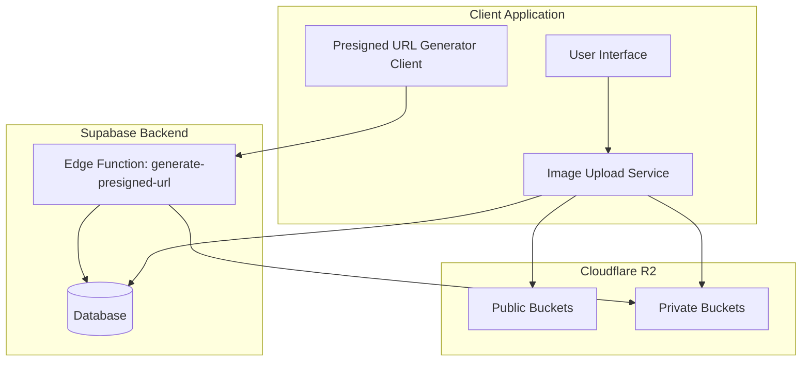
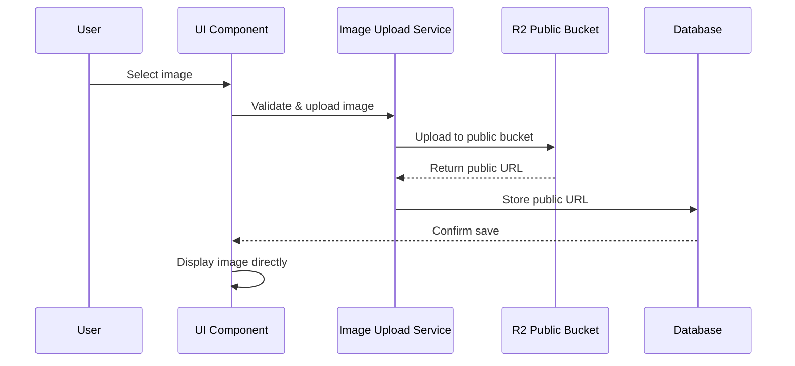
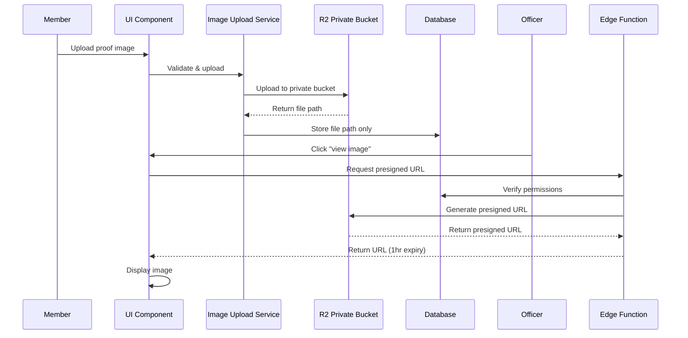

# R2 Image Upload System Design

## Overview

The R2 Image Upload System implements a hybrid architecture using Cloudflare R2 storage to handle image uploads for three distinct features: announcements, events, and volunteer hour verification. The system uses two different security models - public direct URLs for social content (announcements/events) and private presigned URLs for sensitive content (volunteer hour proof images).

This design optimizes for performance, security, and cost efficiency by avoiding Supabase egress fees while maintaining proper access controls across NHS and NHSA organizations.

## Architecture

### High-Level Architecture



### Data Flow Patterns

#### Pattern 1: Public Image Upload (Announcements/Events)


#### Pattern 2: Private Image Upload & Viewing (Volunteer Hours)


## Components and Interfaces

### 1. Image Upload Service (`src/services/ImageUploadService.ts`)

**Purpose**: Centralized service for handling all image upload operations

**Key Methods**:
```typescript
interface ImageUploadService {
  // Public uploads (announcements/events)
  uploadPublicImage(imageUri: string, type: 'announcements' | 'events', orgId: string): Promise<string>
  
  // Private uploads (volunteer hours)
  uploadPrivateImage(imageUri: string, orgId: string, userId: string): Promise<string>
  
  // Validation
  validateImage(imageUri: string): Promise<ValidationResult>
  
  // Utility
  generateFilename(prefix: string, orgId: string, userId?: string): string
}

interface ValidationResult {
  valid: boolean
  error?: string
  fileSize?: number
  mimeType?: string
}
```

**Implementation Details**:
- Uses `@aws-sdk/client-s3` for R2 communication
- Handles environment-based bucket selection
- Implements retry logic for failed uploads
- Provides upload progress callbacks

### 2. R2 Configuration Service (`src/services/R2ConfigService.ts`)

**Purpose**: Manages R2 client configuration and environment variables

**Key Methods**:
```typescript
interface R2ConfigService {
  getS3Client(): S3Client
  getPublicBucketName(): string
  getPrivateBucketName(): string
  getPublicBaseUrl(): string
  validateConfiguration(): boolean
}
```

**Configuration Structure**:
```typescript
interface R2Config {
  accountId: string
  accessKeyId: string
  secretAccessKey: string
  endpoint: string
  publicBucketName: string
  privateBucketName: string
  publicBaseUrl: string
}
```

### 3. Presigned URL Generator (Edge Function)

**Location**: `supabase/functions/generate-presigned-url/index.ts`

**Purpose**: Securely generates temporary URLs for private images

**API Interface**:
```typescript
// Request
interface PresignedUrlRequest {
  imagePath: string
  userId: string
}

// Response
interface PresignedUrlResponse {
  presignedUrl: string
  expiresAt: string
}

// Error Response
interface PresignedUrlError {
  error: string
  code: 'PERMISSION_DENIED' | 'IMAGE_NOT_FOUND' | 'INVALID_REQUEST'
}
```

**Security Logic**:
1. Extract volunteer hour record from image path
2. Verify requesting user has permission:
   - User owns the volunteer hour submission, OR
   - User is officer in same organization
3. Generate presigned URL with 1-hour expiration
4. Return URL or appropriate error

### 4. Image Picker Component (`src/components/ui/ImagePicker.tsx`)

**Purpose**: Reusable UI component for image selection and preview

**Props Interface**:
```typescript
interface ImagePickerProps {
  onImageSelected: (imageUri: string) => void
  onImageRemoved: () => void
  selectedImage?: string
  disabled?: boolean
  placeholder?: string
}
```

**Features**:
- Camera and gallery options
- Image preview with remove option
- Loading states during upload
- Error display for validation failures

### 5. Presigned URL Hook (`src/hooks/usePresignedUrl.ts`)

**Purpose**: React hook for managing presigned URL generation and caching

**Interface**:
```typescript
interface UsePresignedUrlResult {
  generateUrl: (imagePath: string) => Promise<string>
  cachedUrls: Map<string, CachedUrl>
  loading: boolean
  error: string | null
}

interface CachedUrl {
  url: string
  expiresAt: Date
}
```

**Caching Strategy**:
- Cache presigned URLs in memory for 1 hour
- Batch multiple URL requests when possible
- Automatic cache invalidation on expiry

## Data Models

### Database Schema Updates

```sql
-- Add image columns to existing tables
ALTER TABLE announcements ADD COLUMN image_url TEXT NULL;
ALTER TABLE events ADD COLUMN image_url TEXT NULL;
ALTER TABLE volunteer_hours ADD COLUMN image_path TEXT NULL;

-- Add indexes for performance
CREATE INDEX idx_announcements_image_url ON announcements(image_url) WHERE image_url IS NOT NULL;
CREATE INDEX idx_events_image_url ON events(image_url) WHERE image_url IS NOT NULL;
CREATE INDEX idx_volunteer_hours_image_path ON volunteer_hours(image_path) WHERE image_path IS NOT NULL;
```

### File Path Conventions

**Public Images (Announcements)**:
```
announcements/{org_id}/{timestamp}-{randomString}.jpg
Example: announcements/nhs/1699234567890-a1b2c3.jpg
```

**Public Images (Events)**:
```
events/{org_id}/{timestamp}-{randomString}.jpg
Example: events/nhsa/1699234567890-x7y8z9.jpg
```

**Private Images (Volunteer Hours)**:
```
volunteer-hours/{org_id}/{user_id}/{timestamp}-{randomString}.jpg
Example: volunteer-hours/nhs/user123/1699234567890-m4n5o6.jpg
```

### Environment Variables

```typescript
interface EnvironmentConfig {
  // R2 Authentication
  R2_ACCOUNT_ID: string
  R2_ACCESS_KEY_ID: string
  R2_SECRET_ACCESS_KEY: string
  R2_ENDPOINT: string
  
  // Bucket Configuration
  R2_PUBLIC_BUCKET_NAME: string  // nhs-app-public-dev/prod
  R2_PRIVATE_BUCKET_NAME: string // nhs-app-private-dev/prod
  R2_PUBLIC_URL: string          // https://pub-xxxxx.r2.dev
}
```

## Error Handling

### Client-Side Error Handling

**Image Validation Errors**:
```typescript
enum ImageValidationError {
  FILE_TOO_LARGE = 'File size exceeds 5MB limit',
  INVALID_FORMAT = 'Only JPG and PNG files are supported',
  CORRUPTED_FILE = 'Selected file appears to be corrupted',
  NETWORK_ERROR = 'Unable to process image. Check your connection'
}
```

**Upload Error Recovery**:
- Automatic retry for network failures (max 3 attempts)
- Exponential backoff between retries
- User-friendly error messages with actionable guidance
- Graceful degradation when upload fails

### Server-Side Error Handling

**Presigned URL Generation Errors**:
```typescript
enum PresignedUrlError {
  PERMISSION_DENIED = 'You do not have permission to view this image',
  IMAGE_NOT_FOUND = 'The requested image could not be found',
  INVALID_REQUEST = 'Invalid image request parameters',
  SERVICE_UNAVAILABLE = 'Image service temporarily unavailable'
}
```

**Error Response Format**:
```typescript
interface ErrorResponse {
  error: string
  code: string
  timestamp: string
  requestId?: string
}
```

## Testing Strategy

### Unit Testing

**Image Upload Service Tests**:
- File validation logic
- Filename generation
- S3 client configuration
- Error handling scenarios

**Presigned URL Hook Tests**:
- URL caching behavior
- Cache expiration handling
- Batch request optimization
- Error state management

### Integration Testing

**End-to-End Upload Flows**:
- Announcement image upload and display
- Event image upload and display
- Volunteer hour image upload and secure viewing
- Cross-organization access prevention

**Security Testing**:
- Permission verification in Edge Function
- Organization boundary enforcement
- Presigned URL expiration validation
- Unauthorized access attempts

### Performance Testing

**Upload Performance**:
- 5MB file upload completion time (target: <5 seconds)
- Concurrent upload handling
- Network failure recovery time

**Presigned URL Performance**:
- URL generation time (target: <500ms)
- Cache hit rate optimization
- Batch request efficiency

## Security Considerations

### Access Control Matrix

| User Role | Announcement Images | Event Images | Own Volunteer Images | Other Volunteer Images |
|-----------|-------------------|--------------|---------------------|----------------------|
| Member | View | View | Upload/View | No Access |
| Officer | Upload/View | Upload/View | View (same org) | View (same org) |

### Security Measures

**Client-Side Security**:
- File type validation before upload
- File size limits enforcement
- Secure credential storage in environment variables

**Server-Side Security**:
- Organization-based access control in Edge Function
- Presigned URL expiration (1 hour maximum)
- Request rate limiting on Edge Function
- Input validation and sanitization

**Infrastructure Security**:
- Private bucket configuration prevents direct access
- Public bucket limited to read-only access
- R2 credentials with minimal required permissions

## Performance Optimizations

### Client-Side Optimizations

**Image Handling**:
- Lazy loading for image lists
- Image compression before upload (future enhancement)
- Progressive image loading with placeholders

**Caching Strategy**:
- Presigned URL memory caching (1 hour)
- Batch URL generation for lists
- Cache invalidation on expiry

### Server-Side Optimizations

**Edge Function Performance**:
- Connection pooling for database queries
- Minimal permission check queries
- Response caching headers

**R2 Optimizations**:
- Multipart upload for large files (future enhancement)
- CDN integration for global distribution
- Optimized bucket regions

## Implementation Phases

### Phase 1: Foundation (Tasks 1-2)
- Database schema updates
- R2 configuration service
- Basic image upload service
- Shared utility functions

### Phase 2: Public Images (Tasks 3-4)
- Announcement image upload
- Event image upload
- Public image display
- Error handling and validation

### Phase 3: Private Images (Tasks 5-6)
- Presigned URL Edge Function
- Volunteer hour image upload
- Secure image viewing with placeholders
- Permission verification

### Phase 4: Polish (Task 7)
- Comprehensive error handling
- Performance optimizations
- Security testing
- User experience refinements

## Monitoring and Maintenance

### Key Metrics

**Performance Metrics**:
- Average upload time by file size
- Presigned URL generation latency
- Cache hit rate for presigned URLs
- Error rate by operation type

**Usage Metrics**:
- Images uploaded per day by type
- Storage usage by organization
- Presigned URL requests per day

**Security Metrics**:
- Failed permission checks
- Expired URL access attempts
- Cross-organization access attempts

### Maintenance Tasks

**Regular Maintenance**:
- Monitor R2 storage usage and costs
- Review and rotate R2 access credentials
- Clean up expired cached URLs
- Performance optimization based on metrics

**Security Audits**:
- Review Edge Function permission logic
- Validate organization isolation
- Test presigned URL expiration
- Monitor for unauthorized access patterns