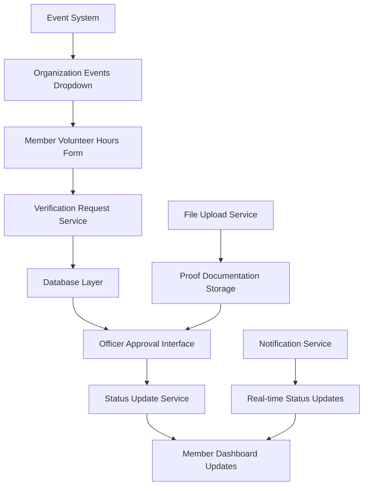

# Volunteer Hours Verification System Design

## Overview

The volunteer hours verification system provides a comprehensive workflow for members to submit volunteer hour requests with proof documentation and enables officers to review, approve, or reject these submissions. The system maintains separate tracking for general volunteer hours and organization-led event hours, with real-time status updates and audit trails.

## Architecture

### System Components



### Data Flow

1. **Submission Flow**: Member Form → Validation → Database Storage → Officer Queue
2. **Approval Flow**: Officer Review → Status Update → Member Notification → Hours Calculation
3. **Rejection Flow**: Officer Review → Rejection Reason → Member Notification → Resubmission Option

## Components and Interfaces

### 1. Enhanced Member Volunteer Hours Form

**Current State Analysis**: The existing form has basic functionality but needs UI improvements and status tracking integration.

**Required Changes**:
- Convert organization events list to dropdown format
- Add status tracking display sections
- Implement pending/approved/rejected request cards
- Add progress bar with organization-specific hours tracking

**New Components**:
```typescript
interface VolunteerHoursFormState {
  pendingRequests: VerificationRequest[];
  approvedRequests: VerificationRequest[];
  rejectedRequests: VerificationRequest[];
  totalHours: number;
  organizationEventHours: number;
}
```

### 2. Officer Verification Interface Enhancement

**Current State Analysis**: Basic approval interface exists but needs tabbed organization and bulk actions.

**Required Changes**:
- Implement three-tab system (Pending/Verified/Rejected)
- Add bulk approval functionality
- Enhanced request cards with complete information display
- Rejection reason input system

**New Tab Structure**:
```typescript
interface OfficerVerificationTabs {
  pending: VerificationRequest[];
  verified: VerificationRequest[];
  rejected: VerificationRequest[];
}
```

### 3. Verification Request Management Service

**New Service Requirements**:
```typescript
interface VerificationRequestService {
  createRequest(data: CreateVerificationRequest): Promise<VerificationRequest>;
  updateRequestStatus(id: string, status: RequestStatus, metadata?: any): Promise<void>;
  getRequestsByMember(memberId: string): Promise<VerificationRequest[]>;
  getRequestsByOrganization(orgId: string, status?: RequestStatus): Promise<VerificationRequest[]>;
  deleteRequest(id: string, memberId: string): Promise<void>;
}
```

### 4. Status Tracking Components

**Request Status Cards**:
- Pending: Yellow tag, all form data display, delete option
- Verified: Green tag, verifying officer info, move to "Recently Approved"
- Rejected: Red tag, rejection reason display, delete/recreate options

**Progress Tracking**:
- Dynamic progress bar updates
- Separate counters for total hours and organization event hours
- Real-time updates when requests are approved

## Data Models

### Enhanced Volunteer Hours Schema

```sql
-- Add status tracking and verification metadata
ALTER TABLE volunteer_hours ADD COLUMN IF NOT EXISTS status VARCHAR(20) DEFAULT 'pending';
ALTER TABLE volunteer_hours ADD COLUMN IF NOT EXISTS rejection_reason TEXT;
ALTER TABLE volunteer_hours ADD COLUMN IF NOT EXISTS verified_by UUID REFERENCES profiles(id);
ALTER TABLE volunteer_hours ADD COLUMN IF NOT EXISTS verified_at TIMESTAMP;
ALTER TABLE volunteer_hours ADD COLUMN IF NOT EXISTS is_organization_event BOOLEAN DEFAULT FALSE;

-- Create index for efficient status queries
CREATE INDEX IF NOT EXISTS idx_volunteer_hours_status ON volunteer_hours(status, org_id);
CREATE INDEX IF NOT EXISTS idx_volunteer_hours_member_status ON volunteer_hours(member_id, status);
```

### Verification Request Interface

```typescript
interface VerificationRequest {
  id: string;
  member_id: string;
  member_name: string;
  org_id: string;
  activity_date: string;
  hours: number;
  description: string;
  event_id?: string;
  event_name?: string;
  is_organization_event: boolean;
  attachment_file_id?: string;
  status: 'pending' | 'verified' | 'rejected';
  rejection_reason?: string;
  verified_by?: string;
  verified_at?: string;
  submitted_at: string;
}
```

## Error Handling

### Validation Rules

1. **Form Validation**:
   - Required fields: event selection, date, hours
   - Hours must be positive decimal
   - Date cannot be future
   - Notes limited to 150 words

2. **Business Logic Validation**:
   - Member can only submit for their organization
   - Officers can only verify for their organization
   - Cannot edit submitted requests (delete/recreate only)

3. **Database Constraints**:
   - Foreign key integrity for member_id, org_id, event_id
   - Status enum constraints
   - Audit trail preservation

### Error Recovery

- **Network Failures**: Retry mechanism with exponential backoff
- **Validation Errors**: Clear user feedback with field-specific messages
- **Permission Errors**: Redirect to appropriate access level
- **Data Conflicts**: Refresh and retry with latest data

## Testing Strategy

### Unit Tests (Optional)
- Form validation logic
- Status update calculations
- Request filtering and sorting

### Integration Tests
- End-to-end submission workflow
- Officer approval/rejection process
- Real-time status updates
- Database transaction integrity

### User Acceptance Testing
- Member submission experience
- Officer review efficiency
- Status visibility and clarity
- Performance with multiple requests

## Implementation Phases

### Phase 1: Database Schema Updates
- Add status tracking columns
- Create necessary indexes
- Update RLS policies for new fields

### Phase 2: Member Interface Enhancement
- Convert events list to dropdown
- Add status tracking sections
- Implement request cards with tags
- Update progress bar calculations

### Phase 3: Officer Interface Redesign
- Implement three-tab system
- Add bulk approval functionality
- Enhanced request display cards
- Rejection reason input system

### Phase 4: Status Management System
- Real-time status updates
- Notification system integration
- Audit trail implementation
- Performance optimization

### Phase 5: Testing and Refinement
- Comprehensive testing suite
- Performance optimization
- User feedback integration
- Documentation completion

## Security Considerations

### Access Control
- Members can only view/manage their own requests
- Officers can only verify requests from their organization
- Audit trail for all status changes
- Secure file upload and storage

### Data Integrity
- Transaction-based status updates
- Immutable audit logs
- Validation at multiple layers
- Backup and recovery procedures

## Performance Optimization

### Database Optimization
- Efficient indexing strategy
- Query optimization for status filtering
- Pagination for large request lists
- Connection pooling

### UI Performance
- Lazy loading for request lists
- Optimistic updates for better UX
- Efficient re-rendering strategies
- Image optimization for proof uploads

## Monitoring and Analytics

### Key Metrics
- Request submission rates
- Approval/rejection ratios
- Average processing time
- User engagement metrics

### Alerting
- Failed submissions
- Pending request backlogs
- System performance issues
- Security anomalies