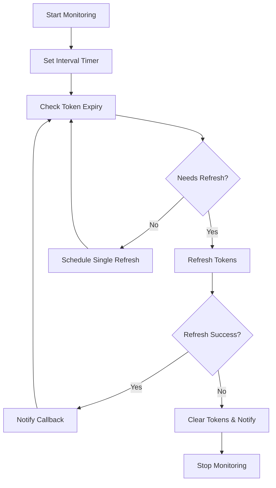
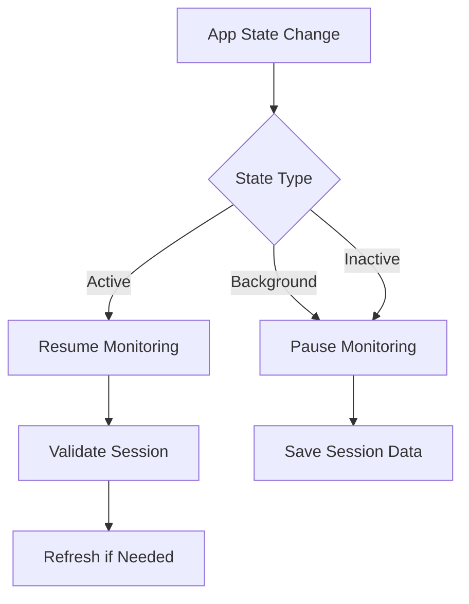

# Background Token Refresh and Monitoring Implementation

## Overview

This implementation adds comprehensive background token refresh and monitoring capabilities to the JWT authentication system, addressing requirements 1.2 and 1.4 from the specification.

## Features Implemented

### 1. Automatic Background Token Refresh (Task 7.1)

#### Enhanced TokenManager Service
- **Background Monitoring Loop**: Continuous monitoring of token expiry status
- **Configurable Monitoring Interval**: Default 60 seconds, minimum 30 seconds
- **Configurable Refresh Buffer**: Default 10 minutes before expiry, minimum 1 minute
- **Callback System**: Notifications for session expiry and refresh events
- **Resource Management**: Proper cleanup of timers and resources

#### Key Methods Added:
```typescript
startBackgroundMonitoring(callbacks?: {
  onSessionExpired?: () => void;
  onSessionRefreshed?: (session: Session) => void;
}): void

stopBackgroundMonitoring(): void
pauseBackgroundMonitoring(): void
resumeBackgroundMonitoring(): void
isBackgroundMonitoringActive(): boolean
setMonitoringInterval(intervalMs: number): void
setRefreshBuffer(bufferSeconds: number): void
```

#### Implementation Details:
- **Dual Refresh Strategy**: Combines scheduled single refresh with continuous background monitoring
- **Battery Optimization**: Pause/resume functionality for app state changes
- **Error Handling**: Graceful handling of refresh failures with callback notifications
- **Prevention of Multiple Refreshes**: Queue system prevents simultaneous refresh requests

### 2. App State Change Handling (Task 7.2)

#### Enhanced AuthContext Integration
- **App State Monitoring**: Listens for active, background, and inactive states
- **Session Validation on Resume**: Validates and refreshes sessions when app becomes active
- **Background Optimization**: Pauses monitoring when app goes to background
- **Session Persistence**: Saves session data before backgrounding

#### App State Behaviors:

**When App Becomes Active:**
1. Resume or start background monitoring
2. Validate current session with server
3. Refresh tokens if needed
4. Restore session from storage if none exists
5. Update Supabase client session

**When App Goes to Background:**
1. Pause background monitoring (battery optimization)
2. Save current session state to storage
3. Keep scheduled refresh active for critical timing

**Error Handling:**
- Network-aware error messages
- Graceful fallback for connectivity issues
- Automatic session cleanup for terminal errors

## Technical Implementation

### Background Monitoring Flow


### App State Integration


## Configuration Options

### Monitoring Interval
- **Default**: 60 seconds (60,000ms)
- **Minimum**: 30 seconds (30,000ms)
- **Purpose**: How often to check token expiry status

### Refresh Buffer
- **Default**: 10 minutes (600 seconds)
- **Minimum**: 1 minute (60 seconds)
- **Purpose**: How early to refresh before actual expiry

## Battery Optimization

The implementation includes several battery optimization strategies:

1. **Pause on Background**: Monitoring pauses when app goes to background
2. **Resume on Active**: Monitoring resumes when app becomes active
3. **Scheduled Refresh Preserved**: Critical single refresh timer remains active
4. **Efficient Checking**: Minimal processing during background checks

## Error Handling

### Network Errors
- Retry logic with exponential backoff
- Network connectivity detection
- Graceful degradation for offline scenarios

### Token Errors
- Invalid token detection and cleanup
- Expired refresh token handling
- Session corruption recovery

### Callback Notifications
- `onSessionExpired`: Called when session cannot be refreshed
- `onSessionRefreshed`: Called when session is successfully refreshed

## Integration Points

### AuthContext Integration
The AuthContext now:
- Starts background monitoring on successful authentication
- Handles monitoring callbacks for UI updates
- Manages app state changes for session persistence
- Provides network-aware error handling

### Session Persistence
- Automatic saving before app backgrounding
- Restoration on app resume
- Validation of restored sessions

## Usage Example

```typescript
// Start monitoring with callbacks
tokenManager.startBackgroundMonitoring({
  onSessionExpired: () => {
    // Handle session expiry (redirect to login, show message, etc.)
    setSession(null);
    setError('Your session has expired. Please log in again.');
  },
  onSessionRefreshed: (refreshedSession) => {
    // Handle successful refresh (update UI, save session, etc.)
    setSession(refreshedSession);
    supabase.auth.setSession(refreshedSession);
  }
});

// Configure monitoring behavior
tokenManager.setMonitoringInterval(120000); // Check every 2 minutes
tokenManager.setRefreshBuffer(300); // Refresh 5 minutes before expiry

// App state handling
AppState.addEventListener('change', (nextAppState) => {
  if (nextAppState === 'active') {
    tokenManager.resumeBackgroundMonitoring();
  } else if (nextAppState === 'background') {
    tokenManager.pauseBackgroundMonitoring();
  }
});
```

## Benefits

1. **Seamless User Experience**: Tokens refresh automatically without user intervention
2. **Battery Efficient**: Monitoring pauses during background states
3. **Robust Error Handling**: Graceful handling of network and token errors
4. **Configurable**: Adjustable monitoring intervals and refresh timing
5. **Resource Safe**: Proper cleanup prevents memory leaks
6. **Network Aware**: Handles offline/online scenarios appropriately

## Requirements Satisfied

- ✅ **Requirement 1.2**: Automatic token refresh using stored refresh token
- ✅ **Requirement 1.4**: Session restoration on app restart with background monitoring
- ✅ **Requirement 2.2**: Session validation when app becomes active
- ✅ **Battery Optimization**: Pause/resume monitoring based on app state
- ✅ **Error Recovery**: Comprehensive error handling and user feedback
- ✅ **Resource Management**: Proper cleanup and timer management

This implementation provides a robust, efficient, and user-friendly background token management system that ensures users stay authenticated while optimizing for battery life and network conditions.