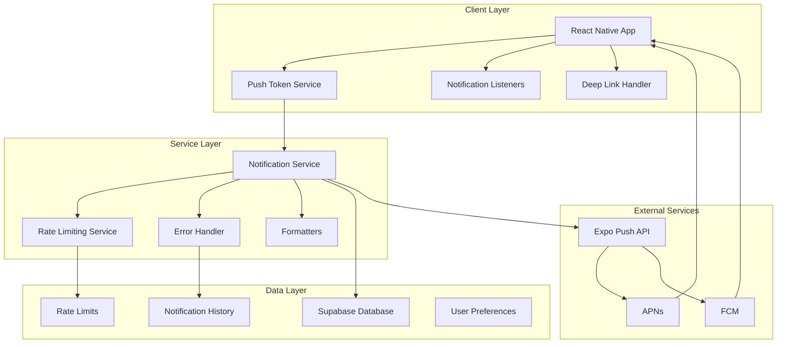
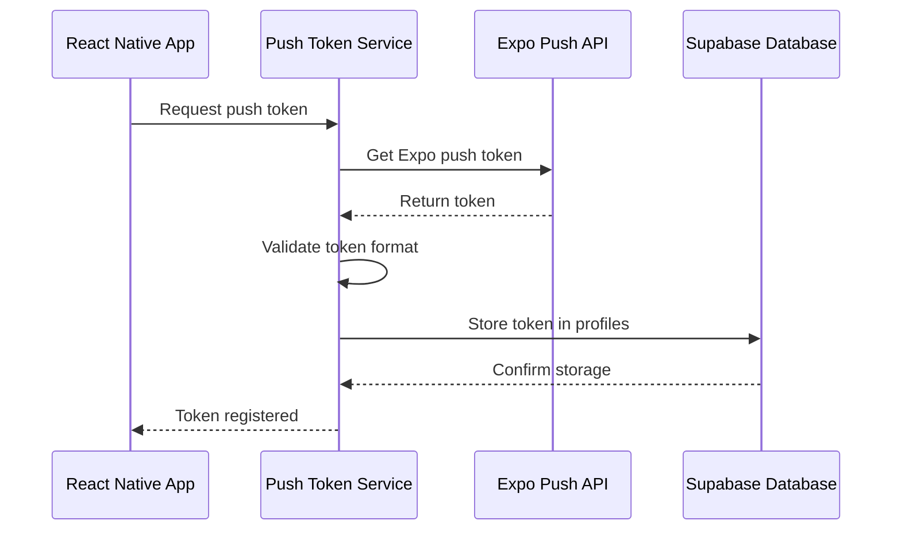
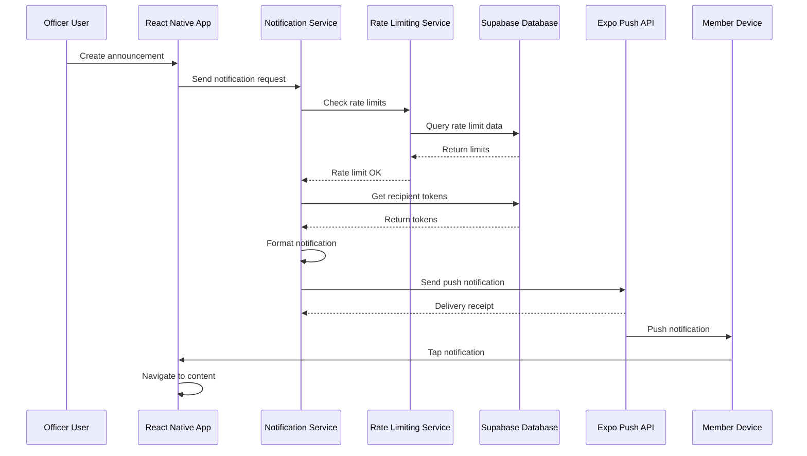
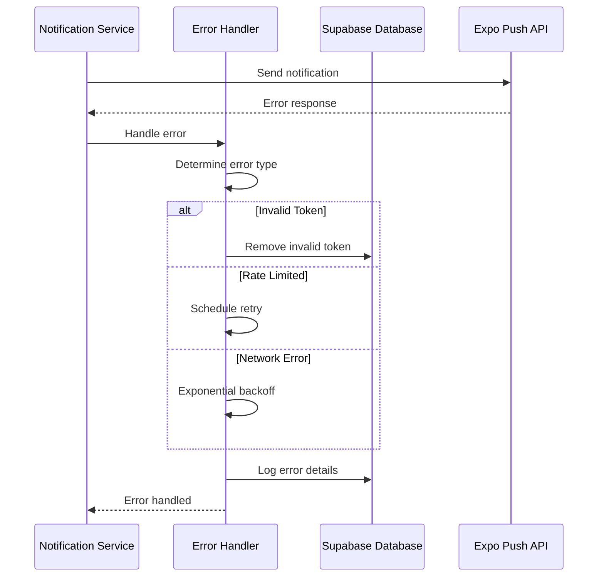

# Push Notification System Architecture

This document provides a comprehensive overview of the NHS app's push notification system architecture, implementation details, and usage patterns.

## Table of Contents

1. [System Overview](#system-overview)
2. [Architecture Components](#architecture-components)
3. [Data Flow](#data-flow)
4. [Service Layer](#service-layer)
5. [Database Schema](#database-schema)
6. [Error Handling](#error-handling)
7. [Performance Optimization](#performance-optimization)
8. [Security Considerations](#security-considerations)
9. [API Reference](#api-reference)
10. [Integration Guide](#integration-guide)

## System Overview

The NHS app's push notification system is built on Expo's push notification service, providing cross-platform notifications for iOS and Android. The system handles four main notification types:

- **Announcements**: Organization-wide notifications from officers
- **Events**: Notifications about new events and activities
- **Volunteer Hours**: Approval/rejection notifications for volunteer work
- **BLE Sessions**: High-priority notifications for attendance sessions

### Key Features

- **Cross-platform compatibility**: Single API for iOS and Android
- **Rate limiting and spam prevention**: Prevents notification abuse
- **Deep linking**: Direct navigation to relevant app screens
- **Error handling and recovery**: Robust error management with retry logic
- **User preferences**: Granular control over notification types
- **Batch processing**: Efficient handling of multiple notifications

## Architecture Components



### Component Responsibilities

#### Client Layer
- **Push Token Service**: Manages device token registration and validation
- **Notification Listeners**: Handles incoming notifications and user interactions
- **Deep Link Handler**: Routes notification taps to appropriate screens

#### Service Layer
- **Notification Service**: Core service for sending notifications
- **Rate Limiting Service**: Prevents spam and manages notification frequency
- **Error Handler**: Manages delivery failures and retry logic
- **Formatters**: Standardizes notification content across types

#### Data Layer
- **Supabase Database**: Stores user preferences, tokens, and notification history
- **Rate Limits**: Tracks notification frequency per user/organization
- **User Preferences**: Manages notification settings and muting

## Data Flow

### 1. Token Registration Flow



### 2. Notification Sending Flow



### 3. Error Handling Flow



## Service Layer

### NotificationService

The core service responsible for sending all types of notifications.

```typescript
class NotificationService {
  // Send announcement to all organization members
  async sendAnnouncement(announcement: AnnouncementData): Promise<void>
  
  // Send event notification to organization members
  async sendEventNotification(event: EventData): Promise<void>
  
  // Send volunteer hours update to specific member
  async sendVolunteerHoursUpdate(
    request: VolunteerHoursData, 
    status: 'approved' | 'rejected'
  ): Promise<void>
  
  // Send high-priority BLE session notification
  async sendBLESessionNotification(session: BLESessionData): Promise<void>
  
  // Send batch notifications efficiently
  async sendBatchNotifications(notifications: NotificationPayload[]): Promise<void>
}
```

### NotificationFormatters

Standardized formatters for each notification type.

```typescript
class NotificationFormatters {
  static announcement = {
    formatTitle: (data: AnnouncementData) => `New Announcement: ${data.title}`,
    formatBody: (data: AnnouncementData) => data.content.substring(0, 100) + '...',
    formatData: (data: AnnouncementData) => ({
      type: 'announcement',
      itemId: data.id,
      orgId: data.org_id,
      priority: 'normal'
    })
  }
  
  static event = {
    formatTitle: (data: EventData) => `New Event: ${data.title}`,
    formatBody: (data: EventData) => `${formatDate(data.date)} • ${data.location}`,
    formatData: (data: EventData) => ({
      type: 'event',
      itemId: data.id,
      orgId: data.org_id,
      priority: 'normal'
    })
  }
  
  // Additional formatters for volunteer hours and BLE sessions...
}
```

### NotificationRateLimitingService

Manages rate limits and spam prevention.

```typescript
class NotificationRateLimitingService {
  // Check if officer can send more announcements
  async checkAnnouncementLimit(orgId: string, officerId: string): Promise<boolean>
  
  // Prevent duplicate notifications
  async checkDuplicateNotification(
    type: string, 
    itemId: string, 
    content: string
  ): Promise<boolean>
  
  // Batch volunteer hours approvals
  async batchVolunteerHoursApprovals(
    approvals: VolunteerHoursApproval[]
  ): Promise<NotificationPayload[]>
  
  // Temporary muting functionality
  async temporaryMute(userId: string, duration: MuteDuration): Promise<void>
}
```

### NotificationErrorHandler

Handles delivery errors and implements retry logic.

```typescript
class NotificationErrorHandler {
  // Handle various delivery errors
  async handleDeliveryError(
    error: DeliveryError,
    token: string,
    userId: string,
    payload?: NotificationPayload
  ): Promise<ErrorHandlingResult>
  
  // Retry with exponential backoff
  async retryWithBackoff(
    operation: () => Promise<void>,
    maxAttempts: number
  ): Promise<void>
  
  // Clean up invalid tokens
  async cleanupInvalidTokens(): Promise<void>
}
```

## Database Schema

### Core Tables

#### profiles (extended)
```sql
ALTER TABLE profiles ADD COLUMN expo_push_token TEXT;
ALTER TABLE profiles ADD COLUMN notifications_enabled BOOLEAN DEFAULT true;
ALTER TABLE profiles ADD COLUMN notification_preferences JSONB DEFAULT '{}';
ALTER TABLE profiles ADD COLUMN muted_until TIMESTAMP WITH TIME ZONE;

-- Indexes for performance
CREATE INDEX idx_profiles_expo_push_token ON profiles(expo_push_token);
CREATE INDEX idx_profiles_notifications_enabled ON profiles(notifications_enabled);
CREATE INDEX idx_profiles_muted_until ON profiles(muted_until);
```

#### notification_rate_limits
```sql
CREATE TABLE notification_rate_limits (
  id UUID PRIMARY KEY DEFAULT gen_random_uuid(),
  org_id UUID REFERENCES organizations(id),
  officer_id UUID REFERENCES auth.users(id),
  notification_type TEXT NOT NULL,
  count INTEGER DEFAULT 1,
  window_start TIMESTAMP WITH TIME ZONE DEFAULT NOW(),
  created_at TIMESTAMP WITH TIME ZONE DEFAULT NOW(),
  
  UNIQUE(org_id, officer_id, notification_type, window_start)
);

-- Indexes
CREATE INDEX idx_rate_limits_org_officer ON notification_rate_limits(org_id, officer_id);
CREATE INDEX idx_rate_limits_window_start ON notification_rate_limits(window_start);
```

#### notification_history (optional)
```sql
CREATE TABLE notification_history (
  id UUID PRIMARY KEY DEFAULT gen_random_uuid(),
  user_id UUID REFERENCES auth.users(id),
  org_id UUID REFERENCES organizations(id),
  notification_type TEXT NOT NULL,
  title TEXT NOT NULL,
  body TEXT NOT NULL,
  data JSONB,
  sent_at TIMESTAMP WITH TIME ZONE DEFAULT NOW(),
  delivery_status TEXT DEFAULT 'sent',
  read_at TIMESTAMP WITH TIME ZONE,
  
  -- Indexes
  INDEX idx_notification_history_user_id (user_id),
  INDEX idx_notification_history_org_id (org_id),
  INDEX idx_notification_history_sent_at (sent_at)
);
```

### Database Functions

#### check_notification_rate_limit
```sql
CREATE OR REPLACE FUNCTION check_notification_rate_limit(
  p_org_id UUID,
  p_officer_id UUID,
  p_notification_type TEXT,
  p_rate_limit INTEGER DEFAULT 10,
  p_window_hours INTEGER DEFAULT 24
) RETURNS BOOLEAN AS $$
DECLARE
  current_count INTEGER;
  window_start TIMESTAMP WITH TIME ZONE;
BEGIN
  window_start := NOW() - INTERVAL '1 hour' * p_window_hours;
  
  SELECT COALESCE(SUM(count), 0) INTO current_count
  FROM notification_rate_limits
  WHERE org_id = p_org_id
    AND officer_id = p_officer_id
    AND notification_type = p_notification_type
    AND window_start >= window_start;
  
  RETURN current_count < p_rate_limit;
END;
$$ LANGUAGE plpgsql;
```

#### record_notification_sent
```sql
CREATE OR REPLACE FUNCTION record_notification_sent(
  p_org_id UUID,
  p_officer_id UUID,
  p_notification_type TEXT
) RETURNS VOID AS $$
BEGIN
  INSERT INTO notification_rate_limits (org_id, officer_id, notification_type, count)
  VALUES (p_org_id, p_officer_id, p_notification_type, 1)
  ON CONFLICT (org_id, officer_id, notification_type, window_start)
  DO UPDATE SET count = notification_rate_limits.count + 1;
END;
$$ LANGUAGE plpgsql;
```

## Error Handling

### Error Types and Responses

#### Expo Push API Errors
```typescript
enum ExpoErrorType {
  DeviceNotRegistered = 'DeviceNotRegistered',
  MessageTooBig = 'MessageTooBig',
  MessageRateExceeded = 'MessageRateExceeded',
  InvalidCredentials = 'InvalidCredentials'
}
```

#### Error Handling Strategies
```typescript
interface ErrorHandlingStrategy {
  [ExpoErrorType.DeviceNotRegistered]: {
    action: 'remove_token',
    retry: false,
    log: true
  },
  [ExpoErrorType.MessageRateExceeded]: {
    action: 'retry_with_delay',
    retry: true,
    delay: 60000, // 1 minute
    log: true
  },
  [ExpoErrorType.MessageTooBig]: {
    action: 'truncate_and_retry',
    retry: true,
    log: true
  },
  [ExpoErrorType.InvalidCredentials]: {
    action: 'log_critical_error',
    retry: false,
    log: true,
    alert: true
  }
}
```

### Retry Logic

#### Exponential Backoff Implementation
```typescript
class RetryManager {
  private calculateDelay(attempt: number): number {
    const baseDelay = 1000; // 1 second
    const maxDelay = 300000; // 5 minutes
    const delay = baseDelay * Math.pow(2, attempt - 1);
    return Math.min(delay, maxDelay);
  }
  
  async retryWithBackoff<T>(
    operation: () => Promise<T>,
    maxAttempts: number = 5
  ): Promise<T> {
    let lastError: Error;
    
    for (let attempt = 1; attempt <= maxAttempts; attempt++) {
      try {
        return await operation();
      } catch (error) {
        lastError = error as Error;
        
        if (attempt === maxAttempts) {
          throw lastError;
        }
        
        const delay = this.calculateDelay(attempt);
        await new Promise(resolve => setTimeout(resolve, delay));
      }
    }
    
    throw lastError!;
  }
}
```

## Performance Optimization

### Batch Processing

#### Notification Batching Strategy
```typescript
class NotificationBatcher {
  private readonly BATCH_SIZE = 100; // Expo's limit
  
  async sendBatchNotifications(notifications: NotificationPayload[]): Promise<void> {
    const batches = this.createBatches(notifications, this.BATCH_SIZE);
    
    for (const batch of batches) {
      await this.sendBatch(batch);
      
      // Small delay between batches to avoid rate limits
      await new Promise(resolve => setTimeout(resolve, 100));
    }
  }
  
  private createBatches<T>(items: T[], batchSize: number): T[][] {
    const batches: T[][] = [];
    for (let i = 0; i < items.length; i += batchSize) {
      batches.push(items.slice(i, i + batchSize));
    }
    return batches;
  }
}
```

### Caching Strategy

#### Token Caching
```typescript
class TokenCache {
  private cache = new Map<string, string[]>();
  private readonly TTL = 300000; // 5 minutes
  
  async getOrganizationTokens(orgId: string): Promise<string[]> {
    const cached = this.cache.get(orgId);
    if (cached) {
      return cached;
    }
    
    const tokens = await this.fetchTokensFromDatabase(orgId);
    this.cache.set(orgId, tokens);
    
    // Auto-expire cache
    setTimeout(() => {
      this.cache.delete(orgId);
    }, this.TTL);
    
    return tokens;
  }
}
```

### Database Optimization

#### Optimized Queries
```sql
-- Efficient token retrieval with filtering
CREATE OR REPLACE FUNCTION get_notification_recipients(
  p_org_id UUID,
  p_notification_type TEXT
) RETURNS TABLE(user_id UUID, expo_push_token TEXT) AS $$
BEGIN
  RETURN QUERY
  SELECT p.id, p.expo_push_token
  FROM profiles p
  JOIN organization_members om ON p.id = om.user_id
  WHERE om.org_id = p_org_id
    AND p.notifications_enabled = true
    AND p.expo_push_token IS NOT NULL
    AND p.expo_push_token != ''
    AND (p.muted_until IS NULL OR p.muted_until < NOW())
    AND (
      p.notification_preferences IS NULL OR
      COALESCE((p.notification_preferences->p_notification_type)::boolean, true) = true
    );
END;
$$ LANGUAGE plpgsql;
```

## Security Considerations

### Token Security

#### Token Encryption
```typescript
class TokenSecurityManager {
  private readonly algorithm = 'aes-256-gcm';
  private readonly key = process.env.TOKEN_ENCRYPTION_KEY;
  
  encryptToken(token: string): string {
    const iv = crypto.randomBytes(16);
    const cipher = crypto.createCipher(this.algorithm, this.key);
    
    let encrypted = cipher.update(token, 'utf8', 'hex');
    encrypted += cipher.final('hex');
    
    return iv.toString('hex') + ':' + encrypted;
  }
  
  decryptToken(encryptedToken: string): string {
    const [ivHex, encrypted] = encryptedToken.split(':');
    const iv = Buffer.from(ivHex, 'hex');
    const decipher = crypto.createDecipher(this.algorithm, this.key);
    
    let decrypted = decipher.update(encrypted, 'hex', 'utf8');
    decrypted += decipher.final('utf8');
    
    return decrypted;
  }
}
```

### Access Control

#### Role-Based Notification Permissions
```typescript
class NotificationPermissionManager {
  async canSendNotification(
    userId: string,
    orgId: string,
    notificationType: string
  ): Promise<boolean> {
    const userRole = await this.getUserRole(userId, orgId);
    
    const permissions = {
      announcement: ['officer', 'admin'],
      event: ['officer', 'admin'],
      volunteer_hours: ['officer', 'admin'],
      ble_session: ['officer', 'admin']
    };
    
    return permissions[notificationType]?.includes(userRole) || false;
  }
}
```

### Data Privacy

#### Content Sanitization
```typescript
class NotificationContentSanitizer {
  sanitizeContent(content: string): string {
    // Remove sensitive information patterns
    const sensitivePatterns = [
      /\b\d{3}-\d{2}-\d{4}\b/g, // SSN
      /\b\d{4}[\s-]?\d{4}[\s-]?\d{4}[\s-]?\d{4}\b/g, // Credit card
      /\b[A-Za-z0-9._%+-]+@[A-Za-z0-9.-]+\.[A-Z|a-z]{2,}\b/g // Email (optional)
    ];
    
    let sanitized = content;
    for (const pattern of sensitivePatterns) {
      sanitized = sanitized.replace(pattern, '[REDACTED]');
    }
    
    return sanitized;
  }
}
```

## API Reference

### Core Notification Methods

#### sendAnnouncement
```typescript
/**
 * Send announcement notification to all organization members
 * @param announcement - Announcement data object
 * @throws {RateLimitError} When rate limit is exceeded
 * @throws {ValidationError} When announcement data is invalid
 */
async sendAnnouncement(announcement: AnnouncementData): Promise<void>
```

#### sendEventNotification
```typescript
/**
 * Send event notification to organization members
 * @param event - Event data object
 * @throws {ValidationError} When event data is invalid
 */
async sendEventNotification(event: EventData): Promise<void>
```

#### sendVolunteerHoursUpdate
```typescript
/**
 * Send volunteer hours status update to member
 * @param request - Volunteer hours request data
 * @param status - Approval status ('approved' | 'rejected')
 * @throws {ValidationError} When request data is invalid
 */
async sendVolunteerHoursUpdate(
  request: VolunteerHoursData, 
  status: 'approved' | 'rejected'
): Promise<void>
```

#### sendBLESessionNotification
```typescript
/**
 * Send high-priority BLE session notification
 * @param session - BLE session data object
 * @throws {ValidationError} When session data is invalid
 */
async sendBLESessionNotification(session: BLESessionData): Promise<void>
```

### Utility Methods

#### validatePushToken
```typescript
/**
 * Validate Expo push token format
 * @param token - Push token to validate
 * @returns {boolean} True if token is valid
 */
validatePushToken(token: string): boolean
```

#### checkRateLimit
```typescript
/**
 * Check if user can send more notifications
 * @param orgId - Organization ID
 * @param userId - User ID
 * @param notificationType - Type of notification
 * @returns {Promise<boolean>} True if within rate limit
 */
async checkRateLimit(
  orgId: string, 
  userId: string, 
  notificationType: string
): Promise<boolean>
```

## Integration Guide

### Basic Integration

#### 1. Initialize Notification Service
```typescript
import { NotificationService } from '../services/NotificationService';

const notificationService = new NotificationService();
```

#### 2. Register Push Token
```typescript
import { PushTokenService } from '../services/PushTokenService';

const pushTokenService = new PushTokenService();

// Register token on app launch
useEffect(() => {
  const registerToken = async () => {
    const token = await pushTokenService.registerToken();
    if (token && user?.id) {
      await pushTokenService.updateTokenInDatabase(token, user.id);
    }
  };
  
  registerToken();
}, [user]);
```

#### 3. Handle Incoming Notifications
```typescript
import { NotificationNavigationHandler } from '../services/NotificationNavigationHandler';

const navigationHandler = new NotificationNavigationHandler();

// Set up notification listeners
useEffect(() => {
  const subscription = Notifications.addNotificationResponseReceivedListener(
    (response) => {
      const data = response.notification.request.content.data;
      navigationHandler.handleNotificationTap(data);
    }
  );
  
  return () => subscription.remove();
}, []);
```

### Advanced Integration

#### Custom Notification Formatters
```typescript
// Create custom formatter for new notification type
const customFormatter = {
  formatTitle: (data: CustomData) => `Custom: ${data.title}`,
  formatBody: (data: CustomData) => data.description,
  formatData: (data: CustomData) => ({
    type: 'custom',
    itemId: data.id,
    orgId: data.org_id,
    priority: 'normal',
    customField: data.customValue
  })
};

// Register formatter
NotificationFormatters.custom = customFormatter;
```

#### Custom Error Handling
```typescript
// Extend error handler for custom error types
class CustomErrorHandler extends NotificationErrorHandler {
  async handleCustomError(error: CustomError): Promise<void> {
    // Custom error handling logic
    await this.logError('custom_error', error.message, {
      customData: error.customData
    });
    
    // Call parent handler for standard errors
    await super.handleDeliveryError(error.type, error.token, error.userId);
  }
}
```

This architecture documentation provides a comprehensive overview of the notification system. For specific implementation details, refer to the individual service files and their accompanying tests.